# Reproducing this analysis

All work performed in this project is intended to be completely reproducible. The following sections describe the necessary steps to reproduce this analysis. Obviously the first step is to clone the parent repository:


```sh
git clone https://github.com/josephsdavid/ChinesePM.git
```

## Reproducing the working environment

### Using Nix

The author is a huge fan of the reproducible package manager [nix](https://nixos.org/nix/), which allows the user to share a reproducible file `shell.nix`. When someone else runs from the command line `nix-shell`, the contents of the file are installed in isolation from the rest of the users system, and is dropped into a shell which perfectly reproduces the working environment of this project. To install remaining dependencies (namely devtools packages), you can run `Rscript libs.R` to automatically install them. This technique is highly recommended. Below are the contents of `libs.R`:


```r
library(remotes)

# packages that dont build on nix shell
options(repos = "http://cran.rstudio.org")
myPackages = installed.packages()
cranPackages <- c("nnfor", "dtwclust")
to.install <- setdiff(cranPackages, myPackages[, 1])
if (length(to.install) > 0) install.packages(to.install)

if (!("tswgewrapped" %in% installed.packages())) {
    install_github("josephsdavid/tswgewrapped")
}
```

The `shell.nix` file can be seen in the github repository.

Note that using this method will also automatically setup tensorflow, Keras, tensorboard, and any other necesary dependencies for deep learning time series models (with R and python). 

### Without Nix

To reproduce the R dependencies required for this analysis, please run `Rscript noNix.R`
This reads `shell.nix`, searches for R packages, compares what is there to what is installed on your computer, and then if they are different, it installs them


```r
library(remotes)
options(repos = "http://cran.rstudio.org")

myPackages = installed.packages()
shell <- readLines("shell.nix")
shell <- shell[grepl(shell, pattern = "rPackages")]
shell <- gsub("rPackages.", "", shell)
qhell <- gsub(" ", "", shell)
otherPackages <- c("nnfor", "dtwclust")
cranPackages <- c(otherPackages, shell)

to.install <- setdiff(cranPackages, myPackages[, 1])
if (length(to.install) > 0) install.packages(to.install)

if (!("tswgewrapped" %in% installed.packages())) {
    install_github("josephsdavid/tswgewrapped")
}
```

Note that this method will require you to manually set up a deep learning stack

## Reproducing the models

To reproduce the models from this project, you have two options: you can either load the saved `.Rda` files, or run all the models (as shown in this report). Note this will likely take several hours, as some of the models take a long time to train, and multiple grid searches over 10,000+ hyperparameters were performed.

# Project Setting

The setting for this project is as follows. You are an employee of the US Embassy in Beijing. After noticing the strange thickness in the air, and getting a bit of a cough, you decide that you do not what any other visitor to suffer breathing the highly dangerous Beijing air. So, you decide you want to get funding for the US Embassy to provide free air pollution masks to all visitors. However, the bureaucrats who can give you the money want to know two things: 

* How much money should we allocate to you over the next year

* How many air pollution masks should be made available each day over the course of the year (rush shipping is expensive)

So, your task is to predict the air pollution levels each day in Beijing at the US Embassy (who records it every hour), so that you can give the bureaucrats an actionable plan. We are assuming that more people will come in to get their free mask on a day where air pollution is bad, than on a day where it isnt, and we certainly do not want to run out, as that would be unfair.

Given this setting, we will now discuss how the data was processed:

# Data Pre-processing

## Data Definition

Open to the public is data from 5 cities:

* Beijing

* Chengdu

* Guangzhou

* Shanghai

* Shenyang

Each of these datasets contains:

* Air quality measurements at multiple locations (including a US Embassy post)

* Humity

* Air pressure

* Temperature

* Precipitation

* Wind direction

* Wind Speed

Measured at every hour. For detailed info on the data quality and collection methods, please refer to [this publication](https://agupubs.onlinelibrary.wiley.com/doi/full/10.1002/2016JD024877)


## Pre-processing pipeline

The next step in our analysis workflow is to get the data ready for analysis. First, we will have to do a few tasks

* import data

* Represent data as a time series

* inspect for NAs

* figure out how to deal with NAs

* store in a conveniently manipulatable format

All of this can be seen in `R/preprocessing.R`, but we will do an in depth explanation here

### Required libraries


```r
library(functional)  # to compose the preprocessing pipeline
library(data.table)  # to read csvs
library(rlist)  # for list manipulations
library(pipeR)  # fast, dumb pipes
library(imputeTS)  # to impute NAs
library(pander)  # so i can read the output
library(foreach)  # go fast
library(doParallel)  # go fast
```

### Data loading

We want to load all of the csv files stored in `data/`, so we will write a function which loads all of them into a list of `data.table`(fast data frame) objects. We will want the name of each item in the list to be the name of the csv file, minus the useless numbers


```r
import <- function(path) {
    # first we list the files in our path, in this case 'data/'
    files <- list.files(path)
    # then we search for csvs
    files <- files[grepl(files, pattern = ".csv")]
    # paste the csv names onto the filepath(data/whatever.csv)
    filepaths <- sapply(files, function(x) paste0(path, x))
    # read them in to a list
    out <- lapply(filepaths, fread)
    # Get rid of .csv in each filename
    fnames <- gsub(".csv", "", files)
    # get rid of the confusing numbers
    fnames <- gsub("[[:digit:]]+", "", fnames)
    # set the names of the list to be the clean filenams
    names(out) <- fnames
    out
}
```

### NA identification

Next we want to see how many NAs we are dealing with. Since we have about 20 million total observations, we will represent these as a proportion. We will apply the NA count function to our list using the beautiful `rapply` function


```r
naCount <- function(xs) {
    rapply(xs, function(x) sum(is.na(x)/length(x)), how = "list")
}
# load in the data now
datadir = "data/"
china <- import(datadir)
pander(naCount(china))
```


  * **BeijingPM_**:

      * **No**: _0_
      * **year**: _0_
      * **month**: _0_
      * **day**: _0_
      * **hour**: _0_
      * **season**: _0_
      * **PM_Dongsi**: _0.5236_
      * **PM_Dongsihuan**: _0.61_
      * **PM_Nongzhanguan**: _0.5259_
      * **PM_US Post**: _0.04178_
      * **DEWP**: _0.00009509_
      * **HUMI**: _0.006447_
      * **PRES**: _0.006447_
      * **TEMP**: _0.00009509_
      * **cbwd**: _0.00009509_
      * **Iws**: _0.00009509_
      * **precipitation**: _0.009204_
      * **Iprec**: _0.009204_

  * **ChengduPM_**:

      * **No**: _0_
      * **year**: _0_
      * **month**: _0_
      * **day**: _0_
      * **hour**: _0_
      * **season**: _0_
      * **PM_Caotangsi**: _0.5356_
      * **PM_Shahepu**: _0.5323_
      * **PM_US Post**: _0.4504_
      * **DEWP**: _0.01006_
      * **HUMI**: _0.01017_
      * **PRES**: _0.009908_
      * **TEMP**: _0.01002_
      * **cbwd**: _0.009908_
      * **Iws**: _0.01014_
      * **precipitation**: _0.0562_
      * **Iprec**: _0.0562_

  * **GuangzhouPM_**:

      * **No**: _0_
      * **year**: _0_
      * **month**: _0_
      * **day**: _0_
      * **hour**: _0_
      * **season**: _0.00001902_
      * **PM_City Station**: _0.3848_
      * **PM_5th Middle School**: _0.5988_
      * **PM_US Post**: _0.3848_
      * **DEWP**: _0.00001902_
      * **HUMI**: _0.00001902_
      * **PRES**: _0.00001902_
      * **TEMP**: _0.00001902_
      * **cbwd**: _0.00001902_
      * **Iws**: _0.00001902_
      * **precipitation**: _0.00001902_
      * **Iprec**: _0.00001902_

  * **ShanghaiPM_**:

      * **No**: _0_
      * **year**: _0_
      * **month**: _0_
      * **day**: _0_
      * **hour**: _0_
      * **season**: _0_
      * **PM_Jingan**: _0.5303_
      * **PM_US Post**: _0.3527_
      * **PM_Xuhui**: _0.521_
      * **DEWP**: _0.0002472_
      * **HUMI**: _0.0002472_
      * **PRES**: _0.0005325_
      * **TEMP**: _0.0002472_
      * **cbwd**: _0.0002282_
      * **Iws**: _0.0002282_
      * **precipitation**: _0.07624_
      * **Iprec**: _0.07624_

  * **ShenyangPM_**:

      * **No**: _0_
      * **year**: _0_
      * **month**: _0_
      * **day**: _0_
      * **hour**: _0_
      * **season**: _0_
      * **PM_Taiyuanjie**: _0.5362_
      * **PM_US Post**: _0.5877_
      * **PM_Xiaoheyan**: _0.5317_
      * **DEWP**: _0.01316_
      * **HUMI**: _0.01293_
      * **PRES**: _0.01316_
      * **TEMP**: _0.01316_
      * **cbwd**: _0.01316_
      * **Iws**: _0.01316_
      * **precipitation**: _0.2427_
      * **Iprec**: _0.2427_


<!-- end of list -->

It looks like the quality of the data collected outside of the US Embassy posts and in cities other than beijing is really bad. Luckily for us, `BeijingPM$PM_US.Post` has relatively high quality data. That being said, we are still going to have to impute the NAs. Before that though, lets convert this to time series data, as we will be imputing the NAs in a different way with time series data than we will for normal data.

### Data transformation: Hourly time series

First, we define a function which converts the data to a time series object:


```r
tots <- function(v) {
    ts(v, frequency = 365 * 24)
}
```

Next, we are going to want want to scale this up, to work on a whole data frame. We will also convert the data frame to a list, just to avoid any typing issues down the road. We also do not want to convert non time series data to time series, so we must avoid those as well:


```r
totslist <- function(df) {
    # define the column names which we do not want to alter
    badlist <- c("No", "year", "month", "day", "hour", "season", "cbwd")
    # get the column names of the original data frame
    nms <- colnames(df)
    # coerce it into a list
    df <- as.list(df)
    # if the name of the item of the list is in our to not change list, do
    # nothing otherwise, convert to ts
    for (name in nms) {
        if (name %in% badlist) {
            df[[name]] <- df[[name]]
        } else {
            df[[name]] <- tots(df[[name]])
        }
    }
    # return the created list
    df
}
```

Next, we want to scale this function to work on a list of data frames:


```r
totsall <- function(xs) {
    lapply(xs, totslist)
}
```

### NA imputation

Imputing NAs in time series is a tricky topic, as we cannot just ignore them (that would mess up our sampling rate). There are several methods of dealing with NAs in time series, including kalman filters, polynomial interpretation, and spline interpolation. In this case, as we are only concerned with the time series that have relatively few NAs, I elected to use spline interpolation, as it is much faster than the kalman filter, while still providing pretty good accuracy. First, a function was constructed to use the try catch pattern to impute NAs of items with the `time-series` class.

The logic is as follows:

* try spline interpolation on the vector
  * if the output is a `ts` object, return the results
  * if the output is an error or a non time series object, return the original object


```r
imp_test <- function(v) {
    out <- try(na.interpolation(v, "spline"))
    ifelse(is.ts(out), return(out), return(v))
}
```

Next, we apply that function to a single list, in parallel to save time:


```r
impute <- function(xs) {
    foreach(i = 1:length(xs), .final = function(x) {
        setNames(x, names(xs))
    }) %dopar% imp_test(xs[[i]])
}
```

Finally, we apply that function to our list of lists


```r
impute_list <- function(xs) {
    lapply(xs, impute)
}
```

Next we are ready to convert to a more useful data structure, and then pipeline all these functions together for quick preprocessing

### Pipelining

First, we will convert our slow, massive list into the fast, superior hash table. For large, complex datasets, a hash table was shown to be at more or less 3 times faster than a list, and as we will be repeatedly accessing data from this, we would prefer it to be a quick index. For more info on R hash tables, please refer to [this link](https://blog.dominodatalab.com/a-quick-benchmark-of-hashtable-implementations-in-r/).


```r
to_hash <- function(xs) {
    list2env(xs, envir = NULL, hash = TRUE)
}
```

Univariate EDA
Next we are ready to pipeline it all together into a single preprocessing function, using `functional::Compose`


```r
preprocess <- Compose(import, totsall, impute_list, to_hash)
```

# Univariate EDA

Required libraries


```r
library(ggthemes)
library(ggplot2)
library(cowplot)
```

## Helper functions

First, we define some helper functions, in order to save us time and make our code more readable. First, lets steal some stuff from `forecast` and `tswge`:


```r
# pretty plots for our analysis
seasonplot <- forecast::ggseasonplot
subseriesplot <- forecast::ggsubseriesplot
lagplot <- forecast::gglagplot
sampplot <- tswge::plotts.sample.wge
# clean up errant data points
clean <- forecast::tsclean
```

Next let us define a function which creates a function to resample time series, and then define ones with new sampling rates. Finally, we will write a function which applies each resampling function to a vector


```r
# resample generator
change_samples <- function(n) {
    function(xs) {
        out <- unname(tapply(xs, (seq_along(xs) - 1)%/%n, sum))
        out <- ts(out, frequency = (8760/n))
        out
    }
}

# daily and weekly sampling, monthly is 4 weeks
to_daily <- change_samples(24)
to_weekly <- change_samples(24 * 7)
to_monthly <- change_samples(24 * 7 * 4)
to_season <- change_samples(24 * (365/4))

# pipelining final cleaning and conversion, removing outlier and the couple
# of errant negative values (which do not make sense)
cleandays <- function(xs) {
    xs %>>% clean %>>% abs %>>% to_daily
}

cleanweeks <- function(xs) {
    xs %>>% clean %>>% abs %>>% to_weekly
}
cleanmonths <- function(xs) {
    xs %>>% clean %>>% abs %>>% to_monthly
}
cleanseas <- function(xs) {
    xs %>>% clean %>>% abs %>>% to_season
}

# resample the whole ts
resample <- function(xs) {
    day <- xs %>>% cleandays %>>% window(end = 6)
    week <- xs %>>% cleanweeks %>>% window(end = 6)
    month <- xs %>>% cleanmonths %>>% window(end = 6)
    seas <- xs %>>% cleanseas %>>% window(end = 6)
    list(day = day, week = week, month = month, season = seas)
}
```

## Wge sample plots

First lets load in and resample our data:


```r
library(ggthemes)
library(ggplot2)
library(cowplot)
china <- preprocess(datadir)
```

```
#> Error in na.interpolation(v, "spline") : Input x is not numeric
#> Error in na.interpolation(v, "spline") : Input x is not numeric
#> Error in na.interpolation(v, "spline") : Input x is not numeric
#> Error in na.interpolation(v, "spline") : Input x is not numeric
#> Error in na.interpolation(v, "spline") : Input x is not numeric
```

```r
bj <- china$BeijingPM_$PM_US
bj <- resample(bj)
```

### Daily data

Now lets look at the sample plots, first with the daily data


```r
dy <- sampplot(bj$day)
```

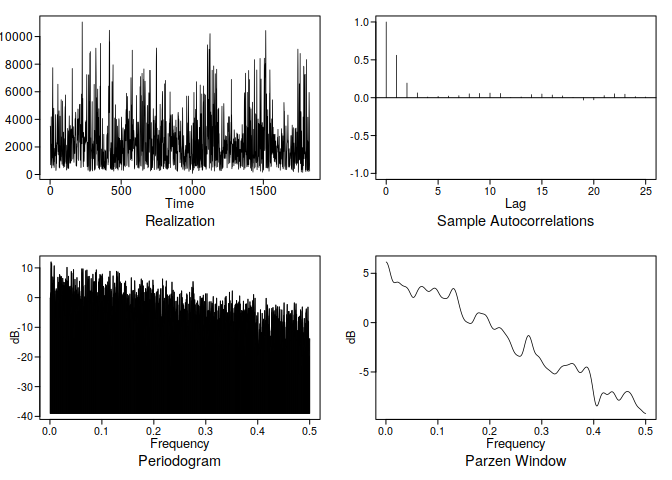

So looking at this, we see that we have what looks like a wandering behavior, according to the frequency plot, but the lags tell a different story. 
There appears to be some strong, high order ARMA stuff going on. Looking at the line plot, we see that there looks to be a long seasonal component, maybe a yearly one, which would explain why the Parzen window is telling us its somewhat wandering. 
We also see what looks to be a few more peaks in the parzenwindow, which either tells us that there is a complex seasonality going on (likely at this sampling rate), or we have some sort of high order ARMA model (or potentially both). 
Lets widen our sampling rate to weeks, months, and quarters, to see if there is anything gong on there, maybe be able to catch that yearly pattern. Lets check it out:


So lets go through each of these plots and discuss:

### Weekly data


```r
wy <- sampplot(bj$w)
```

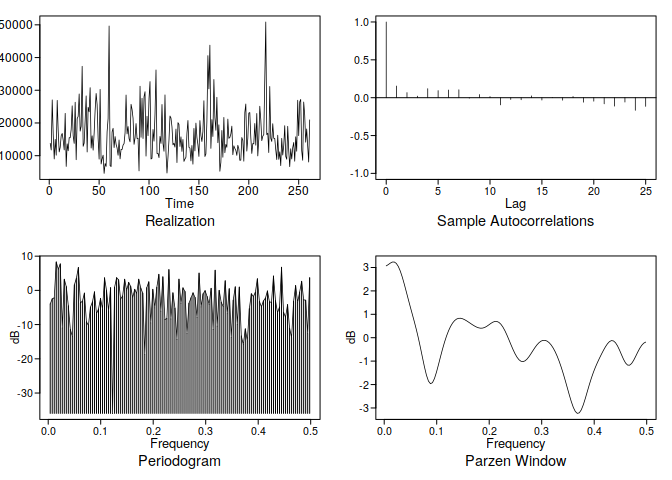

Here we can see better that the time series is not so much wandering, as having a very long seasonal pattern (parzen window). We can tell by the little hook on the left. The ACFs are not so useful in this case, as they are tiny beyond lag 1, due to our weird sampling. However, we know for sure there is some sort of seasonal pattern going on. Potentialy there is a multiseasonal pattern again, or some high order ARMA. 

### Monthly data


```r
my <- sampplot(bj$m)
```


Here we see another oscillating component in the ACFs, indicating again seasonal or high order ARMA (it looks a lot like patemp from tswge, which is seasonal data that is well described by a high order ARMA model). The frequency is again painting a similar picture, there is something going on with a clear frequency. lets look at the quarterly data to know for sure

### Quarterly Data


```r
sy <- sampplot(bj$s)
```


With a bit more than 20 data points, and a supposed seasonal period of a year (4 datapoints), we would *expect* to have a frequency of about 0.2, and lo and behold, we have one. There is some strong evidence of a yearly seasonal pattern in the data (also look at the peak in the ACFs at 4, pretty good evidence right there). The scatterplot tells us a pretty obvious story as well

## Seasonal Plots

Lets check out this seasonal pattern a bit more with a seasonal plot. We will plot them all at once this time and then discuss:


```r
sda <- seasonplot(bj$day) + scale_color_hc() + theme_hc() + ggtitle("Seasonal plot: Daily")
sdw <- bj$week %>>% seasonplot + theme_hc() + scale_color_hc() + ggtitle("Seasonal plot: Weekly")
sdm <- bj$month %>>% seasonplot + theme_hc() + scale_color_hc() + ggtitle("Seasonal plot: Monthly")
sds <- bj$seas %>>% seasonplot + theme_hc() + scale_color_hc() + ggtitle("Seasonal plot: Quarterly")
plot_grid(sda, sdw, sdm, sds, ncol = 2)
```


### Interpretation

The shape of these seasonal plots, and how they all kind of line up, indicate to me that there is some sort of seasonality. It is especially apparent in the Monthly plot, where we have it line up very well, but it is clear in the other plots as well.

> Why is this happening? Is there a real world explanation to this?

Indeed there is. Every year, around November, citywide central heating turns on inBeijing for the winter. This would cause a clear change in the air pollution, as heating is not an energy efficient process. In the summer, it goes down, because central heating is off, and people are more likely to go outside and walk and open their windows.

# Classical Univariate Analysis

With our newfound knowledge, we will now perform a classical analysis of this time series.


```r
library(tswgewrapped)
# > my wrapper scripts of tswge, with more convenient syntax
```

## Setup

The setup for this bit of analysis is as follows:


```r
china <- preprocess("data/")
```

```
#> Error in na.interpolation(v, "spline") : Input x is not numeric
#> Error in na.interpolation(v, "spline") : Input x is not numeric
#> Error in na.interpolation(v, "spline") : Input x is not numeric
#> Error in na.interpolation(v, "spline") : Input x is not numeric
#> Error in na.interpolation(v, "spline") : Input x is not numeric
```

```r
bj <- china$BeijingPM_$PM_US
bjs <- resample(bj)
bjus <- bjs$day

# split
train <- window(bjus, end = 5)
test <- window(bjus, start = 5)

# clean up
rm(bj, bjus, bjs)
```

## S3 objects and methods

To make analysis of models from different libraries with different structures easier, I wrote some S3 classes and generic methods in order to view and evaluate them. These are shown below

### Scores generic

The scores generic is used to get the score of a model of any type. 


```r
scores <- function(obj) {
    UseMethod("scores")
}
```

### The wge class

We next create a `wge` class, where we can store our tswge forecasts


```r
as.wge <- function(x) structure(x, class = "wge")
```

### Model evaluation

We will use 3 methods to evaluate TSWGE models:

#### ASE


```r
ASE <- function(predicted, actual) {
    mean((actual - predicted)^2)
}
```

#### MAPE


```r
MAPE <- function(predicted, actual) {
    100 * mean(abs((actual - predicted)/actual))
}
```

#### Confidence Score

Confidence score is a made up metric I created, in order to evaluate the prediction interval. How it works is as follows: For each point in the actual observations, if it lies outside the prediction interval, give that point a score of 1. If it is within the confidence interval, give it a score of 0. Then, sum up all of the scores.


```r
checkConfint <- function(upper, lower, actual) {
    (actual < lower) | (actual > upper)
}

confScore <- function(upper, lower, actual) {
    rawScores <- ifelse(checkConfint(upper, lower, actual), 1, 0)
    sum(rawScores)
}
```

#### Method for scoring wge objects

To score tswge objects, we can simply use the following S3 method:


```r
scores.wge <- function(xs) {
    mape <- MAPE(xs$f, test)
    ase <- ASE(xs$f, test)
    confs <- confScore(xs$ul, xs$ll, test)
    c(MAPE = mape, ASE = ase, Conf.Score = confs)
}
```

### Visual comparison of prediction and reality

To compare the predictions vs reality of a wge object, I wrote an autoplot method for wge objects:


```r
.testPredPlot <- function(xs) {
    p <- ggplot() + theme_hc() + scale_color_hc()
    doplot <- function(df) {
        p <<- p + geom_line(data = df, aes(x = t, y = ppm, color = type))
    }
    out <- lapply(xs, doplot)
    out[[2]]
}


autoplot.wge <- function(obj) {
    testdf <- data.frame(type = "actual", t = seq_along(test), ppm = as.numeric(test))
    preddf <- data.frame(type = "predicted", t = seq_along(obj$f), ppm = as.numeric(obj$f))
    dfl <- list(testdf, preddf)
    .testPredPlot(dfl)
}
```

## Differencing

Before we begin our analysis, we will create a seasonal and trend based difference of our original time series, mostly for the sake of thouroughness. The difference function used is as follows


```r
difference
```

```
#> function (type, x, n) 
#> {
#>     szn_trans <- function(x, n) {
#>         artrans.wge(x, phi.tr = c(rep(0, n - 1), 1))
#>     }
#>     arima_trans <- function(x, n) {
#>         f <- artrans.wge(x, phi.tr = 1)
#>         if (n == 1) {
#>             res <- f
#>             return(res)
#>         }
#>         else {
#>             arima_trans(f, n - 1)
#>         }
#>     }
#>     if (is.character(enexpr(type)) == F) {
#>         type <- as.character(enexpr(type))
#>     }
#>     if (type %in% c("arima", "ARIMA", "Arima")) {
#>         return((arima_trans(x, n)))
#>     }
#>     if (type %in% c("ARUMA", "Aruma", "aruma", "Seasonal", "seasonal")) {
#>         szn_trans(x, n)
#>     }
#> }
#> <bytecode: 0x1e740e88>
#> <environment: namespace:tswgewrapped>
```

### Seasonal differencing

Our EDA tells us there should be a seasonality of ~365 days. So, lets take that out of our time series.


```r
trainSea <- difference(seasonal, train, 365)
```

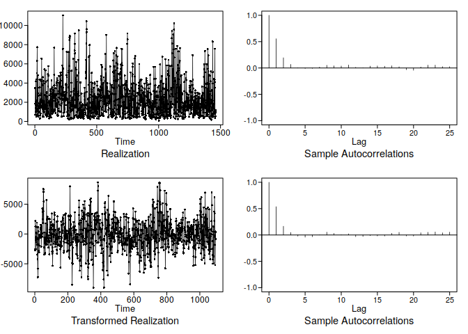

Nothing appeared to happen, This is either because the difference is out of the scale of our ACF plot, (365 is a lot of lags), or because there is something more going on. We will see.


### Trend based differencing

Just for the sake of completeness, lets take a trend based difference of our data:


```r
trainTrend <- difference(arima, train, 1)
```

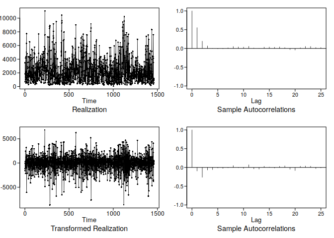

There is little to say here, I do not believe in this model.

## Estimation of order

To estimate the order, first all the train sets were put into a list:


```r
trainers <- list(ARMA = train, Seasonal = trainSea, ARIMA = trainTrend)
```

Then, a wrapper around aic.wge speed up (especially with parallel computation) aic5.wge, was used on the trainers. The speed differences are minor but still much time is saved. The wrappers are:


```r
tswgewrapped:::expand
```

```
#> function (v1, v2) 
#> {
#>     c(sapply(v1, function(x) rep(x, length(v2))))
#> }
#> <bytecode: 0x154a9f38>
#> <environment: namespace:tswgewrapped>
```

```r
tswgewrapped:::rewrite
```

```
#> function (v1, v2) 
#> {
#>     rep(v1, length(v2))
#> }
#> <bytecode: 0xd948eb8>
#> <environment: namespace:tswgewrapped>
```

```r
tswgewrapped:::getpq
```

```
#> function (x, p = 8, q = 5, type = "aic", silent = TRUE) 
#> {
#>     if (silent == FALSE) {
#>         cat("Calculating ", type, " for ARMA(", p, ", ", q, " )\n", 
#>             sep = "")
#>     }
#>     res <- try(aic.wge(x, p, q, type))
#>     if (is.list(res)) {
#>         out <- c(res$p, res$q, res$value)
#>     }
#>     else {
#>         out <- c(p, q, 9999)
#>     }
#>     out
#> }
#> <bytecode: 0x13bccdb8>
#> <environment: namespace:tswgewrapped>
```

```r
aic5
```

```
#> function (x, p = 0:8, q = 0:5, type = "aic", silent = TRUE) 
#> {
#>     ip <- expand(p, q)
#>     iq <- rewrite(q, p)
#>     out <- mapply(function(v1, v2) getpq(x, v1, v2, type, silent), 
#>         ip, iq)
#>     out <- (as.data.frame(t(out)))
#>     colnames(out) <- c("p", "q", type)
#>     head(out[order(out[, 3], decreasing = F), ], 5)
#> }
#> <bytecode: 0xb4c00e8>
#> <environment: namespace:tswgewrapped>
```

```r
tswgewrapped:::aics
```

```
#> [[1]]
#> function (x, p = 0:8, q = 0:5, silent) 
#> aic5(x, p, q, type = "aic", silent)
#> <bytecode: 0xa363cc8>
#> <environment: namespace:tswgewrapped>
#> 
#> [[2]]
#> function (x, p = 0:8, q = 0:5, silent) 
#> aic5(x, p, q, type = "bic", silent)
#> <bytecode: 0xa364390>
#> <environment: namespace:tswgewrapped>
```

```r
aicbic
```

```
#> function (vec, p = 0:8, q = 0:5, parallel = FALSE, cl = NULL, 
#>     silent = FALSE) 
#> {
#>     if (parallel == TRUE) {
#>         parLapply(cl, aics, function(f) f(vec, p, q, silent = TRUE))
#>     }
#>     else {
#>         lapply(aics, function(f) f(vec, p, q, silent))
#>     }
#> }
#> <bytecode: 0xd164060>
#> <environment: namespace:tswgewrapped>
```

The rest of the source code can be seen [here](https://github.com/josephsdavid/tswgewrapped). The calculation of all the AICs and BICs is shown below


```r
aics <- lapply(trainers, aicbic, 0:10, 0:8)
```


```r
pander(aics)
```


  * **ARMA**:

          *

            -------------------------
             &nbsp;   p    q    aic
            -------- ---- --- -------
             **90**   9    8   14.62

             **53**   5    7   14.62

             **68**   7    4   14.62

             **11**   1    1   14.62

             **99**   10   8   14.62
            -------------------------

          *

            ------------------------
             &nbsp;   p   q    bic
            -------- --- --- -------
             **11**   1   1   14.63

             **19**   2   0   14.63

             **4**    0   3   14.63

             **20**   2   1   14.63

             **12**   1   2   14.63
            ------------------------


  * **Seasonal**:

          *

            ------------------------
             &nbsp;   p    q   aic
            -------- ---- --- ------
             **50**   5    4   15.3

             **51**   5    5   15.3

             **72**   7    8   15.3

             **70**   7    6   15.3

             **99**   10   8   15.3
            ------------------------

          *

            ------------------------
             &nbsp;   p   q    bic
            -------- --- --- -------
             **11**   1   1   15.32

             **3**    0   2   15.33

             **19**   2   0   15.33

             **4**    0   3   15.33

             **12**   1   2   15.33
            ------------------------


  * **ARIMA**:

          *

            ------------------------
             &nbsp;   p   q    aic
            -------- --- --- -------
             **58**   6   3   14.63

             **38**   4   1   14.63

             **49**   5   3   14.63

             **44**   4   7   14.63

             **20**   2   1   14.63
            ------------------------

          *

            ------------------------
             &nbsp;   p   q    bic
            -------- --- --- -------
             **20**   2   1   14.64

             **4**    0   3   14.64

             **38**   4   1   14.65

             **56**   6   1   14.66

             **49**   5   3   14.66
            ------------------------


<!-- end of list -->

## Estimation of Parameters

To estimate the parameters, we will be using the wrapper estimation function I wrote (just more convenient syntax), as well as the wrapper around ljung.wge I wrote, which is just more convenient to read (and doesnt print 100 residuals)


```r
estimate
```

```
#> function (xs, p, q = 0, type = "mle", ...) 
#> {
#>     if (q > 0) {
#>         return(est.arma.wge(xs, p, q, ...))
#>     }
#>     else {
#>         return(est.ar.wge(xs, p, type, ...))
#>     }
#> }
#> <bytecode: 0xd884e60>
#> <environment: namespace:tswgewrapped>
```

```r
tswgewrapped:::silence
```

```
#> function (x) 
#> {
#>     sink("/dev/null")
#>     x
#>     sink()
#> }
#> <bytecode: 0x10d7fb90>
#> <environment: namespace:tswgewrapped>
```

```r
hush
```

```
#> function (f) 
#> {
#>     silence(res <- f)
#>     return(res)
#> }
#> <bytecode: 0x15159038>
#> <environment: namespace:tswgewrapped>
```

```r
ljung_box
```

```
#> function (x, p, q, k_val = c(24, 48)) 
#> {
#>     ljung <- function(k) {
#>         hush(ljung.wge(x = x, p = p, q = q, K = k))
#>     }
#>     sapply(k_val, ljung)
#> }
#> <bytecode: 0x89f8b50>
#> <environment: namespace:tswgewrapped>
```
All estimations were run with different orders until the best results were found:

### ARMA estimates


```r
estARMA <- estimate(train, 9, 8)
```

```
#> 
#> Coefficients of Original polynomial:  
#> 0.1142 0.2027 0.4502 -0.5994 0.0159 0.0679 0.7182 0.0737 -0.1559 
#> 
#> Factor                 Roots                Abs Recip    System Freq 
#> 1-1.3528B+0.9692B^2    0.6979+-0.7381i      0.9845       0.1295
#> 1+1.5505B+0.9575B^2   -0.8097+-0.6235i      0.9785       0.3956
#> 1-0.9753B              1.0253               0.9753       0.0000
#> 1+0.5870B+0.8377B^2   -0.3503+-1.0349i      0.9153       0.3020
#> 1+0.4933B             -2.0270               0.4933       0.5000
#> 1-0.4169B              2.3985               0.4169       0.0000
#>   
#> 
```

```r
ljung_box(estARMA$res, 9, 8)
```

```
#>            [,1]             [,2]            
#> test       "Ljung-Box test" "Ljung-Box test"
#> K          24               48              
#> chi.square 12.9592          31.2323         
#> df         7                31              
#> pval       0.07310876       0.4545512
```

```r
par(mfrow = c(1, 2))
acf(estARMA$res)
plot(estARMA$res)
```


### ARUMA estimates


```r
estSeas <- estimate(trainSea, 7, 6)
```

```
#> 
#> Coefficients of Original polynomial:  
#> -0.1091 -0.1268 0.5919 -0.3199 -0.0725 -0.4779 0.2916 
#> 
#> Factor                 Roots                Abs Recip    System Freq 
#> 1+1.5049B+0.9193B^2   -0.8184+-0.6464i      0.9588       0.3936
#> 1+0.5136B+0.8599B^2   -0.2987+-1.0362i      0.9273       0.2947
#> 1-1.3829B+0.7006B^2    0.9869+-0.6733i      0.8370       0.0953
#> 1-0.5265B              1.8993               0.5265       0.0000
#>   
#> 
```

```r
ljung_box(estSeas$res, 7, 6)
```

```
#>            [,1]             [,2]            
#> test       "Ljung-Box test" "Ljung-Box test"
#> K          24               48              
#> chi.square 18.49173         44.33813        
#> df         11               35              
#> pval       0.07084993       0.1339141
```

```r
par(mfrow = c(1, 2))
acf(estARMA$res)
plot(estARMA$res)
```


### ARIMA estimates 


```r
estTrend <- estimate(trainTrend, 6, 3)
```

```
#> 
#> Coefficients of Original polynomial:  
#> -0.0335 -0.6124 0.4784 -0.1861 0.0499 -0.0888 
#> 
#> Factor                 Roots                Abs Recip    System Freq 
#> 1+0.6325B+0.7674B^2   -0.4121+-1.0646i      0.8760       0.3088
#> 1-1.0402B+0.3712B^2    1.4011+-0.8549i      0.6093       0.0872
#> 1+0.4412B+0.3116B^2   -0.7078+-1.6456i      0.5582       0.3147
#>   
#> 
```

```r
ljung_box(estTrend$res, 6, 3)
```

```
#>            [,1]             [,2]            
#> test       "Ljung-Box test" "Ljung-Box test"
#> K          24               48              
#> chi.square 17.52443         43.90103        
#> df         15               39              
#> pval       0.2884916        0.2715692
```

```r
par(mfrow = c(1, 2))
acf(estARMA$res)
plot(estARMA$res)
```

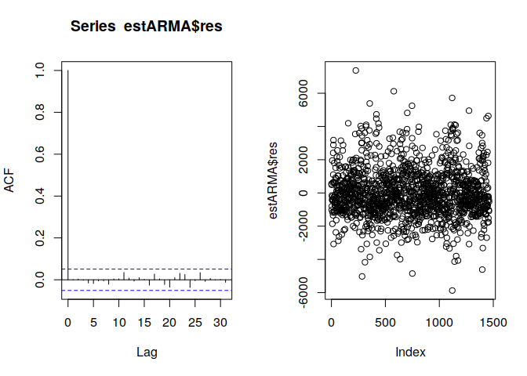

### Discussion

All of our models look pretty good as far as estimates go. However, I think only ARUMA and ARMA are appropriate. We are only proceeding with ARIMA to be thorough.

## Forecasting

We will now proceed with our daily, one year ahead forecasts, as well as the evaluation of them. The `fcst` function from `tswgewrapped` is again just a wrappper for `fore.whatever.wge`:


```r
tswgewrapped::fcst
```

```
#> function (type, ...) 
#> {
#>     phrase <- paste0("fore.", enexpr(type), ".wge")
#>     func <- parse_expr(phrase)
#>     eval(expr((!!func)(...)))
#> }
#> <bytecode: 0x11b65758>
#> <environment: namespace:tswgewrapped>
```

### ARMA


```r
armaCast <- fcst(type = aruma, x = train, phi = estARMA$phi, theta = estARMA$theta, 
    n.ahead = length(test)) %>>% as.wge
```


This one damps to the mean pretty quickly, however this may be a decent predictor, it is common sense that most likely the result will be the mean. It may provide a good baseline in the future, but is not in its own right a very good predictor

### ARUMA


```r
seaCast <- fcst(type = aruma, x = train, phi = estSeas$phi, theta = estSeas$theta, 
    s = 365, n.ahead = length(test)) %>>% as.wge
```

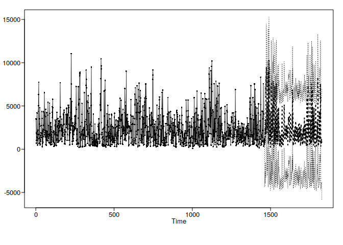

This looks a lot more like the time series, so it is likely a more appropriate model at this forecast horizon, but the forecasts themselves appear to be off

### ARIMA

This will just be the last value over and over, highly uninteresting and not appropriate


```r
trendCast <- fcst(type = aruma, x = train, phi = estTrend$phi, theta = estTrend$theta, 
    d = 1, n.ahead = length(test)) %>>% as.wge
```

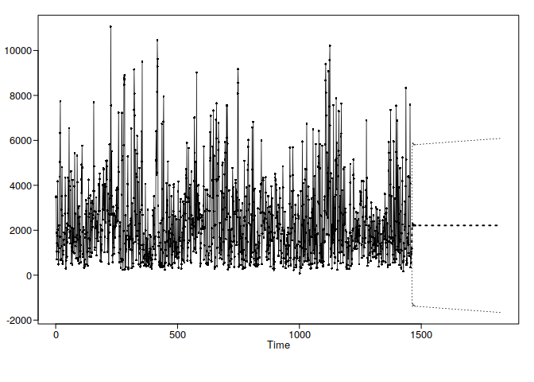

Nothing surprising here

#### Note

An airline model was not attempted, because it does not make much sense.

### Model evaluation

#### Scores
As the appropiateness of each model has already been noted, so now we can look at the scores of each model:


```r
casts <- list(arma = armaCast, seasonal = seaCast, arima = trendCast)
data.frame(list.rbind(lapply(casts, scores)))
```

<div data-pagedtable="false">
  <script data-pagedtable-source type="application/json">
{"columns":[{"label":[""],"name":["_rn_"],"type":[""],"align":["left"]},{"label":["MAPE"],"name":[1],"type":["dbl"],"align":["right"]},{"label":["ASE"],"name":[2],"type":["dbl"],"align":["right"]},{"label":["Conf.Score"],"name":[3],"type":["dbl"],"align":["right"]}],"data":[{"1":"131.6602","2":"3586398","3":"25","_rn_":"arma"},{"1":"159.3523","2":"7189987","3":"33","_rn_":"seasonal"},{"1":"122.1631","2":"3641632","3":"26","_rn_":"arima"}],"options":{"columns":{"min":{},"max":[10]},"rows":{"min":[10],"max":[10]},"pages":{}}}
  </script>
</div>

These results are not surprising, our common sense ARMA forecast in the long run did pretty well (just the mean), and will serve well as a benchmark for future forecasts. Our seasonal model, which looks pretty, did not do so hot, as it was just off a bit. Our ARIMA model only did well because the last value was near the mean. Below we can see the comparison between the train and test:


```r
autoplot(armaCast) + ggtitle("ARMA")
autoplot(seaCast) + ggtitle("Seasonal")
autoplot(trendCast) + ggtitle("ARIMA")
```


## Discussion

Although our forecasts were not very good, especially our ARMA forecast will provide us with a nice benchmark to compare our newer models to, at least by ASE. I think the seasonality is an important factor in this dataset, and although our seasonal model did not do so well, it is worth looking more into. We will proceed next with some multiseasonal approaches. As it is daily data, there tend to be two major seasonalities: a weekly pattern, and a seasonal pattern. 

# Multiseasonal setup

First, we will load up the `forecast` library, in order to get functionality for multiseasonal forecasts


```r
library(forecast)
```

Next, we will recast our train and test sets as msts objects:


```r
periods <- c(7, 365.25)
train <- msts(train, seasonal.periods = periods, end = 5)
test <- msts(test, seasonal.periods = periods, start = 5)
```

# Multiseasonal Dynamic Harmonic Regression

In class, we learned that you can perform standard regression on a time series, then apply our arima analysis on the errors of that time series, and then adjust for that. The `auto.Arima` function does all of this for you, if you supply it with an x regressor. The math behid it is basically representing the equation as follows

$$y_t = \beta_0 + \beta_1 x_{1,t} + ... + \beta_k x_{k,t} + \eta_t$$

where $\eta_t$ is a time series of errors. By estimating that time series, we can then properly estimate $y_t$, as well as make forecasts.

In the case of multiple seasonalities, we can get a bit more creative. We can represent the time series as a fourier series, that is we can write a bunch of sine and cosine terms, a set for our weekly seasonality, and a set for our yearly seasonality. We can see this below:


```r
exampleFourier <- data.frame(fourier(train, K = c(3, 100)))
```

Note that we do three fourier expansions of our weekly trend, and about 100 of our yearly trend. We want to do about half as many expansions as our trend. Lets check out what they look like, we will look at one fourier expansions on a weekly level, and one on a yearly level


```r
weekly <- exampleFourier[[1]] + exampleFourier[[2]] + exampleFourier[[3]] + 
    exampleFourier[[4]] + exampleFourier[[5]] + exampleFourier[[6]]
par(mfrow = c(1, 2))
plot(weekly[1:63], type = "l")
plot(train[1:63], type = "l")
```

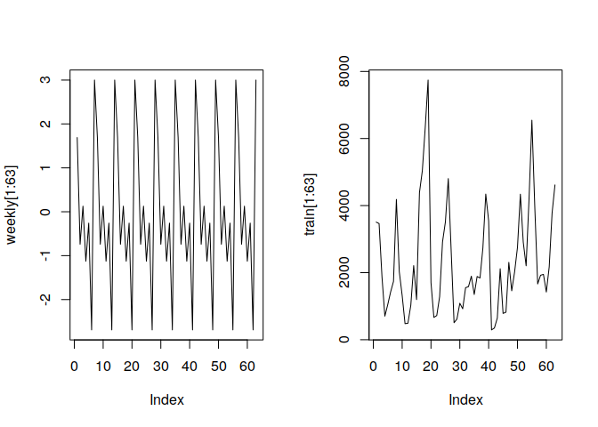

So we see we may not have all of the patterns of the data on a weekly scale represented, but it is not a half bad representation. Let us try with the yearly data as well(we will provide a smoothing on the weekly level first so we can see)

First lets do a low pass filter of our training dataset:


```r
mafun <- function(xs, n) {
    stats::filter(xs, rep(1, n))/n
}
trsmooth <- mafun(train, 56)
```


```r
yearly <- exampleFourier[[7]] + exampleFourier[[8]] + exampleFourier[[9]] + 
    exampleFourier[[10]] + exampleFourier[[11]] + exampleFourier[[12]]
par(mfrow = c(1, 2))
plot(yearly, type = "l")
plot(trsmooth, type = "l")
```

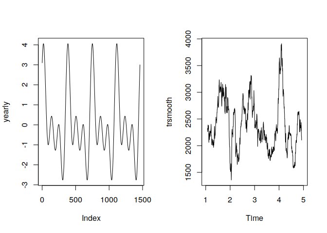

Again, not a bad little representation of the series. If we incorporated the remaining 206 components of our fourier expansion of the yearly trend, we would have a really powerful representation of the 365.25 day period.

We can use this fourier expansion as a regressor on our time series, and this should give us a pretty good representation of the complex seasonality of this series.

## S3 methods

We need to construct a few S3 methods for this section. First, the `forecast` function for `Arima` objects (those constructed by `auto.arima` and `Arima`) returns a forecast of the same length as the length of the external regressors (regardless of the value of `h`).
To deal with this, we write a new method called `newFore`, which creates a new `Arima` object that can make forecasts off the length of the test set, and then does a forecast using those xregressors. This returns the same value as running:


```r
predict(`Arima object`, newxreg = `regressors from the test set`, n.ahead = whatever)
```

but gives us the benefits of the `forecast` object, such as nice plots, confidence intervals, etc.


```r
newFore <- function(...) {
    UseMethod("newFore")
}
newFore.Arima <- function(obj, newdata, xreg = NULL, h = 1) {
    refit <- Arima(newdata, model = obj, xreg = xreg)
    forecast(refit, h = h, xreg = xreg)
}
```

Next we want to add new methods for these forecast objects, so we can view our results in a consitent manner:


```r
as.fore <- function(x) structure(x, class = "fore")

autoplot.fore <- function(obj) {
    testdf <- data.frame(type = "actual", t = seq_along(test), ppm = as.numeric(test))
    preddf <- data.frame(type = "predicted", t = seq_along(test), ppm = as.numeric(obj$fitted[1:length(test)]))
    dfl <- list(testdf, preddf)
    .testPredPlot(dfl)
}

scores.fore <- function(obj) {
    mape <- MAPE(obj$fitted[1:length(test)], test)
    ase <- ASE(obj$fitted, test)
    confs <- confScore(obj$upper[1:length(test)], obj$lower[1:length(test)], 
        test)
    c(MAPE = mape, ASE = ase, Conf.Score = confs)
}
```

## Building the model


First we construct a fourier expansion of both the train and test set:


```r
trainExp <- fourier(train, K = c(3, 100))
testExp <- fourier(test, K = c(3, 100))
```

Next, we plug this in to the auto.arima function, and build our model. Note we are passing the parameter `lambda = 0` into the function. Internally, auto.arima does a Box-Cox transformation on the data before running it, to make the model work smoothly. In our case, we do not want values less than zero, because that wouldnt make sense. So, we set `lambda`, the parameter passed into the box cox transformation to 0, which represents a logarithmic transformation. In turn, this will keep our model, and thus our predictions


```r
mseadyn <- auto.arima(train, seasonal = FALSE, lambda = 0, xreg = trainExp)
```

Lets check out where the roots lie on the unit circle:


```r
autoplot(mseadyn)
```


And lets see what order model it identified within the residuals:


```r
data.frame(p = length(mseadyn$model$phi), q = (mseadyn$model$theta), d = length(mseadyn$model$Delta))
```

<div data-pagedtable="false">
  <script data-pagedtable-source type="application/json">
{"columns":[{"label":["p"],"name":[1],"type":["int"],"align":["right"]},{"label":["q"],"name":[2],"type":["dbl"],"align":["right"]},{"label":["d"],"name":[3],"type":["int"],"align":["right"]}],"data":[{"1":"2","2":"0","3":"0"}],"options":{"columns":{"min":{},"max":[10]},"rows":{"min":[10],"max":[10]},"pages":{}}}
  </script>
</div>

## Forecasting

First, lets look at what the origina forecast looks like, without doing the newFore function:


```r
forecast(mseadyn, xreg = trainExp) %>>% autoplot
```

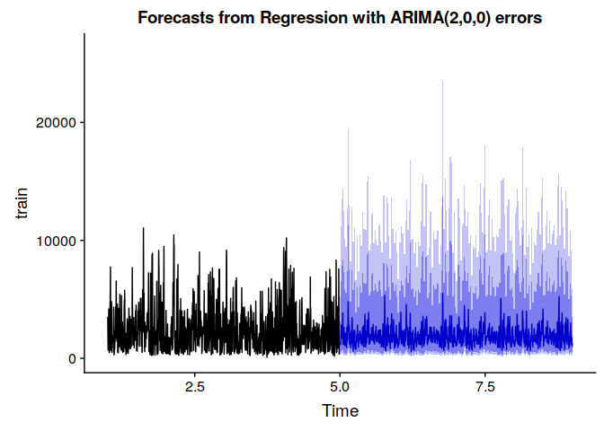

Whew, 5 years ahead. Thats a bit ridiculous.
Now lets run the newFore on it, and then check it out again


```r
mseafor <- newFore(mseadyn, newdata = test, xreg = testExp, h = 1)
autoplot(mseafor)
```

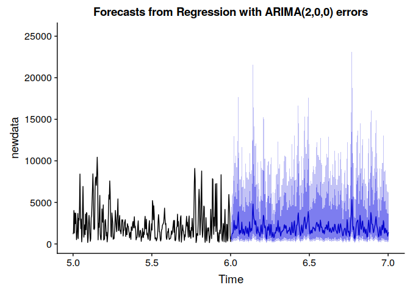

Note the scale on this plot it is now a one year ahead forecast, which is exactly what we want. Unlike the basic ARUMA forecast we did earlier, the confidence limits also lie above zero in all cases, and hopefully it will be a bit better.

## Model Evaluation

This model seems to be slightly more appropriate than the simpler models we fit, as it is highly likely this data is multiseasonal, and I much prefer having a lower ARMA order than (9,8). Lets check it out

### Visual inspection


```r
mseafor %>>% as.fore %>>% autoplot
```

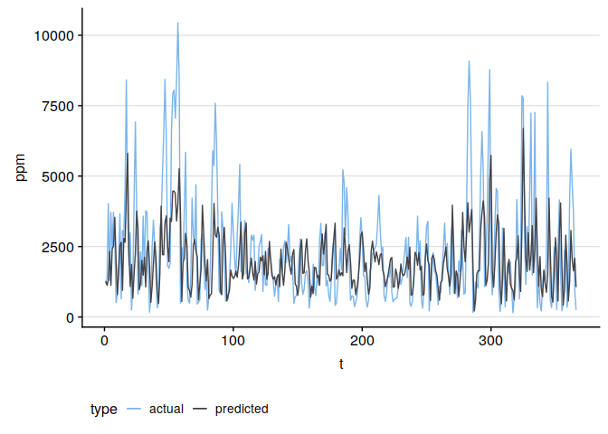


This appears to be a ridiculously good forecast. Lets check out how it scored:

### Scores


```r
mseafor %>>% as.fore %>>% scores %>>% t %>>% data.frame
```

<div data-pagedtable="false">
  <script data-pagedtable-source type="application/json">
{"columns":[{"label":["MAPE"],"name":[1],"type":["dbl"],"align":["right"]},{"label":["ASE"],"name":[2],"type":["dbl"],"align":["right"]},{"label":["Conf.Score"],"name":[3],"type":["dbl"],"align":["right"]}],"data":[{"1":"84.40622","2":"2734198","3":"95"}],"options":{"columns":{"min":{},"max":[10]},"rows":{"min":[10],"max":[10]},"pages":{}}}
  </script>
</div>

Wow. The ASE is nearly a million units smaller than the baseline ARMA forecast. This is a massive improvement, and it seems that our hypothesis of multiseasonality in the data was correct. Lets try a different multiple seasonality technique

# TBATS 

TBATS is a new (to me) and exciting method for dealing with time series with complex seasonalities. TBATS stands for: ***Trigonometric seasonality, Box-Cox transformation, ARMA errors, Trend and Seasonal components***

> What?

Basically, the TBATS algorithm is going to:

* Perform a box-cox transformation on the time series

* Break it into Seasonal, ARMA (noise/residual), and Trend (with damping) components

* Estimate the Seasonal component(s) as a fourier series

* Estimate the trend component

* Estimate the ARMA component

* Combine everything back together to represent the series

> How is this different from what we just did

Unlike what we just did with dynamic harmonic regression, where the seasonality was fixed (as it is simply read in from the attributes of the `msts` object), seasonality here is allowed to change over time, as it is calculated dynamically from the data. This means that that pattern we saw in our EDA in the quarterly season plots can be maybe accounted for (where year one and two had a different pattern than the rest of the years). 

> Why havent i heard of this

Unlike a lot of time series techniques, tbats is from the 21st century, and not well proven. It also has a hard time sometimes, as it is an automated modeling tool, so some special cases will mess it up. It also is exceptionally slow, without using parallel processing it took about 20 minutes to run, on this small amount of data. Despite this, one of its great strengths is its automation, making it very easy to get a pretty good model, a lot of the time.

Lets go ahead and get into it.

## S3 methods

`tbats` comes from the `forecast` package, and has similar issues with forecasting as we saw above (its forecasts are the same length as the data it was trained on, `h` is ignored). So lets write a newFore method for `bats` objects


```r
newFore.bats <- function(obj, newdata, h = 1) {
    refit <- tbats(model = obj, y = newdata)
    forecast(refit, h)
}
```

Thankfully, the structure of a tbats forecast is exactly the same as the structure of our dynamic regression forecasts, so for the rest of the methods, we can just coerce our tbats forecasts into `fore` objects.

## Model Building

First, lets note whether train and test are msts or ts objects, just for sanity


```r
sapply(list(train, test), class)
```

```
#>      [,1]   [,2]  
#> [1,] "msts" "msts"
#> [2,] "ts"   "ts"
```

Ok great we are good to go.


```r
cores <- parallel::detectCores()
# > [1] 12
bjbats <- tbats(train, use.parallel = TRUE, num.cores = cores - 1)
autoplot(bjbats)
```

This is interesting too, so we see the I think trend that the algorithm smoothed out of the time series. Lets go ahead and make the forecast and see how we did


```r
load("analysis/daily/tbats.Rda")
```
## Forecasting

Since we already know what will happen if we just make a forecast with the `forecast` function, lets instead use our `newFore` method without comparison


```r
batF <- newFore(obj = bjbats, test, h = 366)
autoplot(batF)
```


Interesting. What is the autoplot showing us? It is a good question. It is hard to say whether this model is any good or not just from this. Lets try looking at the actual forecasted values with our autoplot method

## Model Evaluation

### Visual Inspection


```r
forbats <- as.fore(batF)
autoplot(forbats)
```

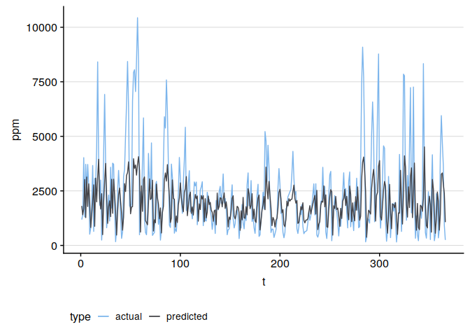

The autoplot of the forecast itself was strange, but looking at the fitted values, it was a pretty dang good forecast. 
It is interesting how both of these multiseasonal models captured the shape of the data nicely (see around the 100 point mark), but not the scale. 
TBATS did an exceptional job of getting the shape of the data (even more than our dynamic regression, see around `t = 200`), but it did worse as far as scaling goes.

Lets check out the scores:

### Scores


```r
scores(forbats) %>>% data.frame
```

<div data-pagedtable="false">
  <script data-pagedtable-source type="application/json">
{"columns":[{"label":[""],"name":["_rn_"],"type":[""],"align":["left"]},{"label":["."],"name":[1],"type":["dbl"],"align":["right"]}],"data":[{"1":"81.37734","_rn_":"MAPE"},{"1":"2602563.60211","_rn_":"ASE"},{"1":"76.00000","_rn_":"Conf.Score"}],"options":{"columns":{"min":{},"max":[10]},"rows":{"min":[10],"max":[10]},"pages":{}}}
  </script>
</div>

By the numbers, this is an exceptional model as well (or at least better than our naive baseline). As far as appropriateness goes, it is hard to say as the TBATS algorithm is a bit black box. However, it got a pretty good forecast and looks similar to our original data, so I will give it a pass. I believe the fact that the seasonality can change is what made this a bit better than our regression with ARMA errors. 

# Prophet Algorithm

Facebook released their internal fast and easy forecasting algorithm, `prophet`.
The prophet algorithm works in the following manner:

* It decomposes the time series into seasonal, trend, and holiday components.

* The seasonal component is estimated as in TBATS, with fourier series. By default, it looks for a daily (if we have sub daily data), weekly, and yearly trends, but these can be specified (for example we can include a 5 day work week). These fourier series are then multiplied by a normal distribution with the same variance as our data.

* The trend component is modeled basically as logistic growth. However, it is not just simple logistic growth, they use piecewise logistic growth, which means that the trend component is allowed to change with time. 
  * If the trend does not follow a logistic growth pattern, it also checks for a linear trend with changepoitnts (aka a piecewise function).

* If  a list of holidays and events with their dates are provided, a matrix of dummy variable regressors for them is added to the model.

* Components are combined as a general additive model (GAM), and then you are done

## S3 methods

We will give the usual S3 methods. Because prophet forecasts include the entire dataset, we will have to write methods that take out the training parts. First, we define the coercion method


```r
as.proph <- function(x) structure(x, class = "proph")
```

Next we define our autoplot and scoring methods:


```r
scores.proph <- function(obj) {
    c(ase = ASE(obj$yhat[-(1:length(train))], test), mape = MAPE(obj$yhat[-(1:length(train))], 
        test))
}

autoplot.proph <- function(obj) {
    testdf <- data.frame(type = "actual", t = seq_along(test), ppm = as.numeric(test))
    preddf <- data.frame(type = "predicted", t = seq_along(test), ppm = as.numeric(obj$yhat[-(1:length(train))]))
    dfl <- list(testdf, preddf)
    .testPredPlot(dfl)
}
```

## Building a model

First, we need to load the data in the proper format


```r
st <- as.Date("2010-1-1")
en <- as.Date("2013-12-31")
trainDates <- seq(st, en, by = "day")
# data MUST BE IN THIS EXACT FORMAT
traindf <- data.frame(ds = trainDates, y = as.numeric(train))
```

Next, lets make our model. This is pretty easy


```r
library(prophet)
model <- prophet(traindf)
```

## Forecasting

First, we must make a data frame for the future, because prophet has a silly API


```r
future <- make_future_dataframe(model, periods = 366)
```

Now we can forecast, with the `predict` function


```r
fore <- predict(model, future)
plot(model, fore)
```

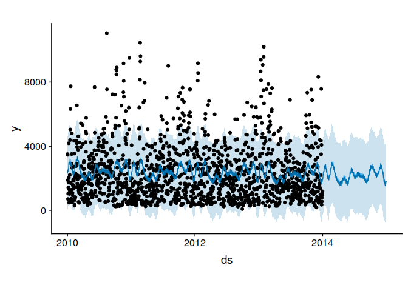

We can also view how it modeled/forecasted all the components


```r
prophet_plot_components(model, fore) + theme_hc()
```

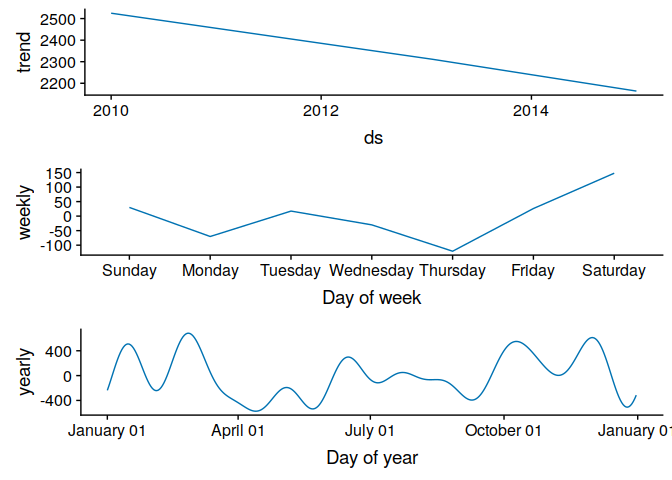

```
#> NULL
```

## Model Evaluation

Lets check out how we did. First, lets take a look at our forecast:


```r
pfore <- as.proph(fore)
autoplot(pfore)
```

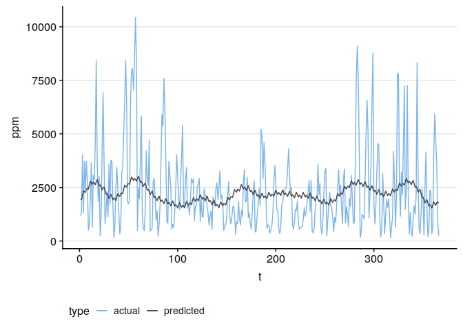

# Discussion of Multiseasonal models as a whole

Considering the nature of our data, and our background knowledge of central heating in china, both of these multiseasonal models seem to be more or less appropriate. They both handle this seasonality in a similar manner, and both proved a very reasonable forecast.

# Multivariate Setup

Now it is time for us to dive in to the hopefully even more powerful multivariate models. Before we do so, we are going to need to redefine our train and test sets, which means we are going to have to write some more functions. Instead of confusing ourselves, lets go ahead and clean away our train and test sets, to avoid confusion:


```r
rm(train, test)
```


## Functions

First, we are now going to have to convert our non time series/numerical data to daily, which means we will have to find a new method of resampling them. 
For that, we are going to find the most common categorical value in each day, and then take that. We will use the `.mode` function, defined below:


```r
.mode <- function(x) {
    ux <- unique(x)
    ux[which.max(tabulate(match(x, ux)))]
}

.mode(c(rep("cat", 4), rep("dog", 8), rep("moose", 1)))
```

```
#> [1] "dog"
```

Next we are going to write a function which lumps the categorical variables into groups of each day, takes the `.mode` of each group, and returns a new vector in that format.

For the lumping, we will use the `%/%` operator, which returns an integer specifying how many times a number divides another number. For instance:


```r
((1:50) - 1)%/%5
```

```
#>  [1] 0 0 0 0 0 1 1 1 1 1 2 2 2 2 2 3 3 3 3 3 4 4 4 4 4 5 5 5 5 5 6 6 6 6 6
#> [36] 7 7 7 7 7 8 8 8 8 8 9 9 9 9 9
```

Then, we will use the glorious `tapply` function, which does the same thing as the apply family, except it applies the function onto a grouped variable (table apply).


```r
.dailyMode <- function(xs) {
    out <- tapply(xs, (seq_along(xs) - 1)%/%24, .mode)
    out <- unname(out)
    out[1:1826]  # the number of days in 6 years, because we cleaned away extra days
}
```

Next we are going to write a function that applies this (and our daily time series conversion) onto a list of time series objects and categorical, and spit out a data frame:


```r
dlist <- function(xs) {
    tsbj <- xs %>>% purrr::keep(is.ts)
    tsnobj <- xs %>>% purrr::discard(is.ts)
    out <- append(lapply(tsbj, function(x) window(cleandays(x), end = 6)), lapply(tsnobj, 
        .dailyMode))
    as.data.frame(out)
}
```

Finally, we are going to write a function that creates a train set and a test set of data frames of time series and categorical variables. Note the use of the `<<-` superassignment operator. This causes the value to be stored one level out, so if it is a single level function, this will cause the value to be stored in the global environment:


```r
dfsplit <- function(df, n = 5) {
    index <- length(window(df[[1]], end = n))
    tsdf <- df %>% purrr::keep(is.ts)
    nodf <- df %>% purrr::discard(is.ts)
    outs <- lapply(tsdf, function(x) window(x, end = n))
    outn <- nodf[1:index, ]
    train <<- as.data.frame(append(outs, outn))
    tests <- lapply(tsdf, function(x) window(x, start = n))
    test <<- as.data.frame(append(tests, nodf[(index):nrow(nodf), ]))
}
```

Note we have to do things in this weird way, because otherwise it is extremely difficult to preserve the class `ts`, which we would like for time series data to be in. Just cbinding or anything like that breaks it immediately.

# Multivariate EDA

First, lets load up our data:


```r
bj <- (china$BeijingPM_)
bj2 <- dlist(bj)
dfsplit(bj2)
```

Before we begin our analysis, it is definitely important to do more EDA, as we have a whole lot more information. First, lets plot all the time series in the training dataframe:


```r
library(tidyverse)

plotAllTs <- function(df) {
    df %>% keep(is.ts) %>% gather() %>% mutate(.data = ., t = rep(1:nrow(df), 
        (nrow(.)/nrow(df)))) %>% ggplot(aes(x = t, y = value)) + facet_wrap(~key, 
        scales = "free") + geom_line() + theme_hc() + theme(axis.text.y = element_blank())
}
plotAllTs(train)
```

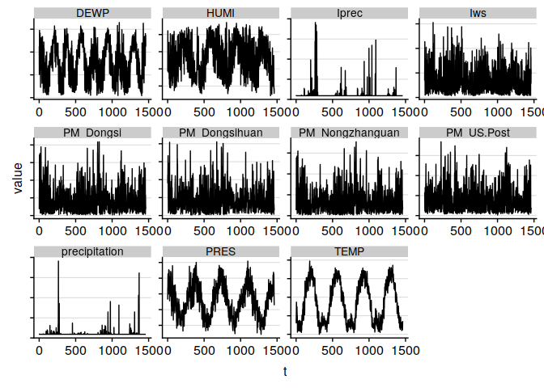

Already, we see some interesting stuff. First of all we probably want to get rid of the other stations observing particulates in our analysis, as this isnt very interesting. Of all the time seres here, humidity appears to have a similar trend pattern to our target. Pressure looks similar but a bit off, so at a high lag maybe it is interesting. Dewpoint has the wrong period, and lprec and precipitation are the same but hard to glean anything out of.

## Analysis of wind direction:

Lets see if the wind direction is of any use to us:


```r
ggplot(train) + geom_point(aes(x = No, y = PM_US.Post, color = cbwd)) + geom_line(aes(x = No, 
    y = PM_US.Post, alpha = 0.1)) + geom_smooth(aes(x = No, y = PM_US.Post), 
    method = "auto") + theme_hc() + scale_color_hc()
```


Just upon a glimpse this is not that useful. Lets look at a table:


```r
train %>% arrange(cbwd) %>% group_by(cbwd) %>% summarise(mean = mean(PM_US.Post))
```

<div data-pagedtable="false">
  <script data-pagedtable-source type="application/json">
{"columns":[{"label":["cbwd"],"name":[1],"type":["fctr"],"align":["left"]},{"label":["mean"],"name":[2],"type":["dbl"],"align":["right"]}],"data":[{"1":"cv","2":"3841.032"},{"1":"NE","2":"1630.285"},{"1":"NW","2":"1641.000"},{"1":"SE","2":"2743.310"}],"options":{"columns":{"min":{},"max":[10]},"rows":{"min":[10],"max":[10]},"pages":{}}}
  </script>
</div>

It looks like it is an interesting factor to some degree, but at this scale with our mode technique, it is probably strongly distorted. Still it is worth a look. We will note this and examine it when we are performing our models.

## Analysis of all numeric variables


```r
plot_vs_response <- function(x) {
    plot(train$PM_US.Post ~ train[[x]], xlab = x)
    lw1 <- loess(train$PM_US.Post ~ train[[x]])
    j <- order(train[[x]])
    lines(train[[x]][j], lw1$fitted[j], col = "red", lwd = 3)
}


numNames <- train %>% purrr::keep(is.numeric) %>% names
numNames <- numNames[-c(1:4, 11:17)]

par(mfrow = c(2, 3))
lapply(numNames, plot_vs_response)
```


So all of these appear to be fairly interesting i think. However, the summing technique we performed does not make these plots easily interpretable. Mathematically however, they likely still work out, as it is the relationship that matters. When we do linear regression, whether or not we have the total temperature sum or the mean (sum/n) should not make a difference in the significance of the relationships, only the slopes. This means we should be ok. Precipitation does not look useful. 

## CCF analysis

Lets look at the cross correlation between all the variables next:


```r
ppm <- train$PM_US.Post
ccfplot <- function(x) {
    ccf(ppm, train[[x]], main = x)
}
ccfs <- lapply(numNames, ccfplot)
```

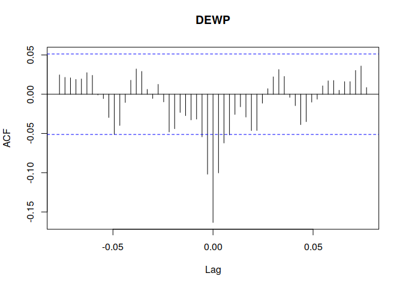

It appears that low lags are where these variables have the most cross correlation, other than temperature, which seems to have a bigger CCF at a pretty far from zero lag.

Next, to further our EDA, lets perform a cluster analysis of the time series data

# Time Series Clustering

There are two types of clustering techniques: Subsequence clustering, and multivariate clustering. Thankfully for us, it has been [definitively shown](https://www.cs.ucr.edu/~eamonn/meaningless.pdf) that subsequence clustering (mostly used for anomaly detection, but also for determining if we should break a time series into multiple time series for forecasting) is completely useless. However, multivariate time series clustering is still a valid and exciting technique.

Multivariate time series clustering is commonly used in the world of quantitative finance, to determine which stocks react to other which other stocks. By finding out if X stock is associated with Y stock, they can do things to make money. With further research, they can determine the nature of the relationship between X stock and Y stock. 
If X stock grows with Y stock, they can time their investments so that when they see Y stock grow, they do something that makes them money with X stock. If the relationship is negative, they can bet on Y stock (which is growing) and short X stock.

We can attempt to use this clustering to get a better idea of how our time series are associated with each other.

## More info on clustering time series

[source](https://rdrr.io/cran/dtwclust/f/inst/doc/dtwclust.pdf)

### Types of time series clustering

#### Hierarchical Clustering

Hierarchical clustering works in one of 2 ways:

1. Each item is given its own group. Groups are compared by a similarity metric. Good groups are merged. This is tried over and over until the clusters do not get better.

2. All the items are put in a group. The group is divided until it cannot be divided more without messing up the clusters

#### Partitional Clustering

Partitional Clustering kind of works the opposite of hierarchical clustering. With partitional clustering, you specify the number of groups, and it then solves the problem of maximizing inter cluster distance while minimizing intra cluster distrance. An example of this is kmeans.

#### Fuzzy Clustering

Fuzzy clustering is similar to partitional clustering, except instead of *hard* clusters, they are *soft* or fuzzy. This means that items can be in multiple clusters, but more in one cluster than another. An example of this is c-means.

### Time series distance measuers

#### Dynamic Time Warping


Dynamic time warping, or DTW, pictured above, finds the best way to warp two time series to line up with each other over time. It creates a matrix which has dimensions m*n, where m and n are the size of two different time series. It does this for every possible pair. Then, for each matrix, it finds a path of indices which has the minimum number of steps and costs the least to line the two time series up. The distance measure is then computed based on the the number of steps it took to line the two up, weighted by cost. For more info please see the aforementioned paper

#### Shape-Based Distance (SBD)

Shape based distance is more or less a cheaper version of DTW. What it does is it takes the cross correlation between the two time series (with normalized coefficients), makes a series out of that, fourier transforms that, and calculates the distance based off of that fourier series. 


#### Global Alignment Kernel (GAK)

A global alignment kernel is another powerful distance measure (albeit really computational expensive). Instead of calculating a matrix of costs, and then running through that (relatively cheap), it calculates a set of all possible alignments and minimizes that, and then returns a similarity measure based on that alignment. Its a bit complex but the aforementioned paper explains it nicely.

### Centroids

#### Shape extraction

Shape extraction works very similarly to SBD. It picks a random time series as a centroid, and uses SBD to match it to the other time series optimally. As mentioned in the paper, it uses an eigenvector of a matrix made wit SBD aligned series

#### DTW barycenter averaging (DBA)

This centroid is represented by the average of a bunch of points grouped by their DTW alignments. It select a random centroid series, and with each iteration, it calculates the DTW alignment with each series in the cluster and the centroid. This is repeated until convergence is met.

#### Partition around mediods (PAM)

A mediod is just a time series whose average distance to all the other objects in the cluster is at the smallest (and an element of the original data). Then, that cluster is partitioned around all the mediods iteratively. IN our case, a given number of series are chosen as initial centroids. Then all the distances are calculated, and then clusters are created based off of those distances. Then, it picks the one that is closest to all the other time series in the new clusters as a mediod, and does it again, until convergence

## Moving Forward

Now that we have a basic understanding of how time series clustering works, we can try it out.

## Clustering setup


```r
library(dtwclust)

traints <- as.list(keep(train, is.ts))
```

Now that we have our data and libraries loaded, lets set ourselves up for parallel computation:


```r
# alter for the appropriate number of cores for you my computer has 12, but
# i have a lot of tabs open define the cluster
workers <- makeCluster(10L)
# load the necessary libraries onto the cluster
invisible(clusterEvalQ(workers, library(dtwclust)))
# register the cluster for parallel computation
registerDoParallel(workers)
```

## Partitional Clustering

As we are new to this, lets set ourselves up for a grid search of a bunch of clusters. We will first check out a partitional cluster. For this, we want to use the `dtw` distance metric, but also check out the `DBA` centroid. We will also play with their normalization methods, and the time window they use in alignment. we will also try out 2-6 clusters

### Grid search setup


```r
cfg <- compare_clusterings_configs(types = "partitional", k = 2L:6L, controls = list(partitional = partitional_control(iter.max = 40L)), 
    distances = pdc_configs("distance", partitional = list(dtw_basic = list(window.size = seq(from = 5L, 
        to = 50L, by = 5L), norm = c("L1", "L2")))), centroids = pdc_configs("centroid", 
        share.config = c("p"), dba = list(window.size = seq(from = 5L, to = 50L, 
            by = 5L), norm = c("L1", "L2"))), no.expand = c("window.size", "norm"))
```

For evaluation, as we do not have labeled data, we will use silhouette validation as our metric.


```r
evaluators <- cvi_evaluators("Sil")
```

### Partitional Grid Search

Lets find the best cluster now:


```r
comparison <- compare_clusterings(traints, types = "partitional", configs = cfg, 
    seed = 666L, score.clus = evaluators$score, pick.clus = evaluators$pick)

stopCluster(cl)
registerDoSEQ()
```

### Partitional grid search: model picking


```r
comparison$results$partitional %>% arrange(desc(Sil))
```

<div data-pagedtable="false">
  <script data-pagedtable-source type="application/json">
{"columns":[{"label":["config_id"],"name":[1],"type":["chr"],"align":["left"]},{"label":["rep"],"name":[2],"type":["int"],"align":["right"]},{"label":["k"],"name":[3],"type":["int"],"align":["right"]},{"label":["pam.precompute"],"name":[4],"type":["lgl"],"align":["right"]},{"label":["iter.max"],"name":[5],"type":["int"],"align":["right"]},{"label":["symmetric"],"name":[6],"type":["lgl"],"align":["right"]},{"label":["version"],"name":[7],"type":["int"],"align":["right"]},{"label":["preproc"],"name":[8],"type":["chr"],"align":["left"]},{"label":["distance"],"name":[9],"type":["chr"],"align":["left"]},{"label":["centroid"],"name":[10],"type":["chr"],"align":["left"]},{"label":["window.size_distance"],"name":[11],"type":["int"],"align":["right"]},{"label":["norm_distance"],"name":[12],"type":["chr"],"align":["left"]},{"label":["window.size_centroid"],"name":[13],"type":["int"],"align":["right"]},{"label":["norm_centroid"],"name":[14],"type":["chr"],"align":["left"]},{"label":["Sil"],"name":[15],"type":["dbl"],"align":["right"]}],"data":[{"1":"config19_1","2":"1","3":"2","4":"TRUE","5":"40","6":"FALSE","7":"2","8":"none","9":"dtw_basic","10":"dba","11":"50","12":"L1","13":"50","14":"L1","15":"0.88071609"},{"1":"config15_1","2":"1","3":"2","4":"TRUE","5":"40","6":"FALSE","7":"2","8":"none","9":"dtw_basic","10":"dba","11":"45","12":"L1","13":"45","14":"L1","15":"0.88060122"},{"1":"config13_1","2":"1","3":"2","4":"TRUE","5":"40","6":"FALSE","7":"2","8":"none","9":"dtw_basic","10":"dba","11":"40","12":"L1","13":"40","14":"L1","15":"0.88049684"},{"1":"config11_1","2":"1","3":"2","4":"TRUE","5":"40","6":"FALSE","7":"2","8":"none","9":"dtw_basic","10":"dba","11":"35","12":"L1","13":"35","14":"L1","15":"0.88036420"},{"1":"config9_1","2":"1","3":"2","4":"TRUE","5":"40","6":"FALSE","7":"2","8":"none","9":"dtw_basic","10":"dba","11":"30","12":"L1","13":"30","14":"L1","15":"0.88021183"},{"1":"config7_1","2":"1","3":"2","4":"TRUE","5":"40","6":"FALSE","7":"2","8":"none","9":"dtw_basic","10":"dba","11":"25","12":"L1","13":"25","14":"L1","15":"0.88001811"},{"1":"config5_1","2":"1","3":"2","4":"TRUE","5":"40","6":"FALSE","7":"2","8":"none","9":"dtw_basic","10":"dba","11":"20","12":"L1","13":"20","14":"L1","15":"0.87974572"},{"1":"config3_1","2":"1","3":"2","4":"TRUE","5":"40","6":"FALSE","7":"2","8":"none","9":"dtw_basic","10":"dba","11":"15","12":"L1","13":"15","14":"L1","15":"0.87935227"},{"1":"config1_1","2":"1","3":"2","4":"TRUE","5":"40","6":"FALSE","7":"2","8":"none","9":"dtw_basic","10":"dba","11":"10","12":"L1","13":"10","14":"L1","15":"0.87849030"},{"1":"config17_1","2":"1","3":"2","4":"TRUE","5":"40","6":"FALSE","7":"2","8":"none","9":"dtw_basic","10":"dba","11":"5","12":"L1","13":"5","14":"L1","15":"0.87607289"},{"1":"config20_1","2":"1","3":"2","4":"TRUE","5":"40","6":"FALSE","7":"2","8":"none","9":"dtw_basic","10":"dba","11":"50","12":"L2","13":"50","14":"L2","15":"0.86084154"},{"1":"config16_1","2":"1","3":"2","4":"TRUE","5":"40","6":"FALSE","7":"2","8":"none","9":"dtw_basic","10":"dba","11":"45","12":"L2","13":"45","14":"L2","15":"0.86075799"},{"1":"config14_1","2":"1","3":"2","4":"TRUE","5":"40","6":"FALSE","7":"2","8":"none","9":"dtw_basic","10":"dba","11":"40","12":"L2","13":"40","14":"L2","15":"0.86070053"},{"1":"config12_1","2":"1","3":"2","4":"TRUE","5":"40","6":"FALSE","7":"2","8":"none","9":"dtw_basic","10":"dba","11":"35","12":"L2","13":"35","14":"L2","15":"0.86062439"},{"1":"config10_1","2":"1","3":"2","4":"TRUE","5":"40","6":"FALSE","7":"2","8":"none","9":"dtw_basic","10":"dba","11":"30","12":"L2","13":"30","14":"L2","15":"0.86052439"},{"1":"config8_1","2":"1","3":"2","4":"TRUE","5":"40","6":"FALSE","7":"2","8":"none","9":"dtw_basic","10":"dba","11":"25","12":"L2","13":"25","14":"L2","15":"0.86041508"},{"1":"config6_1","2":"1","3":"2","4":"TRUE","5":"40","6":"FALSE","7":"2","8":"none","9":"dtw_basic","10":"dba","11":"20","12":"L2","13":"20","14":"L2","15":"0.86022788"},{"1":"config4_1","2":"1","3":"2","4":"TRUE","5":"40","6":"FALSE","7":"2","8":"none","9":"dtw_basic","10":"dba","11":"15","12":"L2","13":"15","14":"L2","15":"0.85998899"},{"1":"config2_1","2":"1","3":"2","4":"TRUE","5":"40","6":"FALSE","7":"2","8":"none","9":"dtw_basic","10":"dba","11":"10","12":"L2","13":"10","14":"L2","15":"0.85925111"},{"1":"config18_1","2":"1","3":"2","4":"TRUE","5":"40","6":"FALSE","7":"2","8":"none","9":"dtw_basic","10":"dba","11":"5","12":"L2","13":"5","14":"L2","15":"0.85728752"},{"1":"config20_2","2":"1","3":"3","4":"TRUE","5":"40","6":"FALSE","7":"2","8":"none","9":"dtw_basic","10":"dba","11":"50","12":"L2","13":"50","14":"L2","15":"0.61650722"},{"1":"config8_2","2":"1","3":"3","4":"TRUE","5":"40","6":"FALSE","7":"2","8":"none","9":"dtw_basic","10":"dba","11":"25","12":"L2","13":"25","14":"L2","15":"0.60552053"},{"1":"config6_2","2":"1","3":"3","4":"TRUE","5":"40","6":"FALSE","7":"2","8":"none","9":"dtw_basic","10":"dba","11":"20","12":"L2","13":"20","14":"L2","15":"0.60161205"},{"1":"config3_2","2":"1","3":"3","4":"TRUE","5":"40","6":"FALSE","7":"2","8":"none","9":"dtw_basic","10":"dba","11":"15","12":"L1","13":"15","14":"L1","15":"0.59108623"},{"1":"config5_2","2":"1","3":"3","4":"TRUE","5":"40","6":"FALSE","7":"2","8":"none","9":"dtw_basic","10":"dba","11":"20","12":"L1","13":"20","14":"L1","15":"0.58918616"},{"1":"config1_2","2":"1","3":"3","4":"TRUE","5":"40","6":"FALSE","7":"2","8":"none","9":"dtw_basic","10":"dba","11":"10","12":"L1","13":"10","14":"L1","15":"0.58832704"},{"1":"config7_2","2":"1","3":"3","4":"TRUE","5":"40","6":"FALSE","7":"2","8":"none","9":"dtw_basic","10":"dba","11":"25","12":"L1","13":"25","14":"L1","15":"0.58755440"},{"1":"config15_2","2":"1","3":"3","4":"TRUE","5":"40","6":"FALSE","7":"2","8":"none","9":"dtw_basic","10":"dba","11":"45","12":"L1","13":"45","14":"L1","15":"0.58476543"},{"1":"config17_2","2":"1","3":"3","4":"TRUE","5":"40","6":"FALSE","7":"2","8":"none","9":"dtw_basic","10":"dba","11":"5","12":"L1","13":"5","14":"L1","15":"0.57932463"},{"1":"config14_2","2":"1","3":"3","4":"TRUE","5":"40","6":"FALSE","7":"2","8":"none","9":"dtw_basic","10":"dba","11":"40","12":"L2","13":"40","14":"L2","15":"0.56585876"},{"1":"config16_2","2":"1","3":"3","4":"TRUE","5":"40","6":"FALSE","7":"2","8":"none","9":"dtw_basic","10":"dba","11":"45","12":"L2","13":"45","14":"L2","15":"0.56555031"},{"1":"config12_2","2":"1","3":"3","4":"TRUE","5":"40","6":"FALSE","7":"2","8":"none","9":"dtw_basic","10":"dba","11":"35","12":"L2","13":"35","14":"L2","15":"0.56539602"},{"1":"config10_2","2":"1","3":"3","4":"TRUE","5":"40","6":"FALSE","7":"2","8":"none","9":"dtw_basic","10":"dba","11":"30","12":"L2","13":"30","14":"L2","15":"0.56497419"},{"1":"config4_2","2":"1","3":"3","4":"TRUE","5":"40","6":"FALSE","7":"2","8":"none","9":"dtw_basic","10":"dba","11":"15","12":"L2","13":"15","14":"L2","15":"0.56198186"},{"1":"config2_2","2":"1","3":"3","4":"TRUE","5":"40","6":"FALSE","7":"2","8":"none","9":"dtw_basic","10":"dba","11":"10","12":"L2","13":"10","14":"L2","15":"0.55167272"},{"1":"config19_2","2":"1","3":"3","4":"TRUE","5":"40","6":"FALSE","7":"2","8":"none","9":"dtw_basic","10":"dba","11":"50","12":"L1","13":"50","14":"L1","15":"0.54008762"},{"1":"config18_2","2":"1","3":"3","4":"TRUE","5":"40","6":"FALSE","7":"2","8":"none","9":"dtw_basic","10":"dba","11":"5","12":"L2","13":"5","14":"L2","15":"0.53180931"},{"1":"config11_2","2":"1","3":"3","4":"TRUE","5":"40","6":"FALSE","7":"2","8":"none","9":"dtw_basic","10":"dba","11":"35","12":"L1","13":"35","14":"L1","15":"0.53129360"},{"1":"config1_3","2":"1","3":"4","4":"TRUE","5":"40","6":"FALSE","7":"2","8":"none","9":"dtw_basic","10":"dba","11":"10","12":"L1","13":"10","14":"L1","15":"0.49765874"},{"1":"config15_3","2":"1","3":"4","4":"TRUE","5":"40","6":"FALSE","7":"2","8":"none","9":"dtw_basic","10":"dba","11":"45","12":"L1","13":"45","14":"L1","15":"0.49398034"},{"1":"config6_4","2":"1","3":"5","4":"TRUE","5":"40","6":"FALSE","7":"2","8":"none","9":"dtw_basic","10":"dba","11":"20","12":"L2","13":"20","14":"L2","15":"0.49320659"},{"1":"config17_3","2":"1","3":"4","4":"TRUE","5":"40","6":"FALSE","7":"2","8":"none","9":"dtw_basic","10":"dba","11":"5","12":"L1","13":"5","14":"L1","15":"0.48061574"},{"1":"config20_4","2":"1","3":"5","4":"TRUE","5":"40","6":"FALSE","7":"2","8":"none","9":"dtw_basic","10":"dba","11":"50","12":"L2","13":"50","14":"L2","15":"0.47487609"},{"1":"config17_5","2":"1","3":"6","4":"TRUE","5":"40","6":"FALSE","7":"2","8":"none","9":"dtw_basic","10":"dba","11":"5","12":"L1","13":"5","14":"L1","15":"0.47444532"},{"1":"config14_3","2":"1","3":"4","4":"TRUE","5":"40","6":"FALSE","7":"2","8":"none","9":"dtw_basic","10":"dba","11":"40","12":"L2","13":"40","14":"L2","15":"0.47131549"},{"1":"config16_3","2":"1","3":"4","4":"TRUE","5":"40","6":"FALSE","7":"2","8":"none","9":"dtw_basic","10":"dba","11":"45","12":"L2","13":"45","14":"L2","15":"0.47102108"},{"1":"config8_3","2":"1","3":"4","4":"TRUE","5":"40","6":"FALSE","7":"2","8":"none","9":"dtw_basic","10":"dba","11":"25","12":"L2","13":"25","14":"L2","15":"0.45358377"},{"1":"config4_4","2":"1","3":"5","4":"TRUE","5":"40","6":"FALSE","7":"2","8":"none","9":"dtw_basic","10":"dba","11":"15","12":"L2","13":"15","14":"L2","15":"0.45040157"},{"1":"config4_3","2":"1","3":"4","4":"TRUE","5":"40","6":"FALSE","7":"2","8":"none","9":"dtw_basic","10":"dba","11":"15","12":"L2","13":"15","14":"L2","15":"0.44678711"},{"1":"config13_4","2":"1","3":"5","4":"TRUE","5":"40","6":"FALSE","7":"2","8":"none","9":"dtw_basic","10":"dba","11":"40","12":"L1","13":"40","14":"L1","15":"0.44662091"},{"1":"config9_3","2":"1","3":"4","4":"TRUE","5":"40","6":"FALSE","7":"2","8":"none","9":"dtw_basic","10":"dba","11":"30","12":"L1","13":"30","14":"L1","15":"0.44649883"},{"1":"config19_5","2":"1","3":"6","4":"TRUE","5":"40","6":"FALSE","7":"2","8":"none","9":"dtw_basic","10":"dba","11":"50","12":"L1","13":"50","14":"L1","15":"0.44468503"},{"1":"config18_3","2":"1","3":"4","4":"TRUE","5":"40","6":"FALSE","7":"2","8":"none","9":"dtw_basic","10":"dba","11":"5","12":"L2","13":"5","14":"L2","15":"0.43121308"},{"1":"config14_5","2":"1","3":"6","4":"TRUE","5":"40","6":"FALSE","7":"2","8":"none","9":"dtw_basic","10":"dba","11":"40","12":"L2","13":"40","14":"L2","15":"0.41536943"},{"1":"config3_4","2":"1","3":"5","4":"TRUE","5":"40","6":"FALSE","7":"2","8":"none","9":"dtw_basic","10":"dba","11":"15","12":"L1","13":"15","14":"L1","15":"0.40485280"},{"1":"config7_3","2":"1","3":"4","4":"TRUE","5":"40","6":"FALSE","7":"2","8":"none","9":"dtw_basic","10":"dba","11":"25","12":"L1","13":"25","14":"L1","15":"0.40457011"},{"1":"config7_5","2":"1","3":"6","4":"TRUE","5":"40","6":"FALSE","7":"2","8":"none","9":"dtw_basic","10":"dba","11":"25","12":"L1","13":"25","14":"L1","15":"0.40201652"},{"1":"config12_3","2":"1","3":"4","4":"TRUE","5":"40","6":"FALSE","7":"2","8":"none","9":"dtw_basic","10":"dba","11":"35","12":"L2","13":"35","14":"L2","15":"0.40130077"},{"1":"config10_3","2":"1","3":"4","4":"TRUE","5":"40","6":"FALSE","7":"2","8":"none","9":"dtw_basic","10":"dba","11":"30","12":"L2","13":"30","14":"L2","15":"0.39668887"},{"1":"config18_4","2":"1","3":"5","4":"TRUE","5":"40","6":"FALSE","7":"2","8":"none","9":"dtw_basic","10":"dba","11":"5","12":"L2","13":"5","14":"L2","15":"0.39118861"},{"1":"config8_4","2":"1","3":"5","4":"TRUE","5":"40","6":"FALSE","7":"2","8":"none","9":"dtw_basic","10":"dba","11":"25","12":"L2","13":"25","14":"L2","15":"0.39044105"},{"1":"config3_5","2":"1","3":"6","4":"TRUE","5":"40","6":"FALSE","7":"2","8":"none","9":"dtw_basic","10":"dba","11":"15","12":"L1","13":"15","14":"L1","15":"0.38979674"},{"1":"config15_4","2":"1","3":"5","4":"TRUE","5":"40","6":"FALSE","7":"2","8":"none","9":"dtw_basic","10":"dba","11":"45","12":"L1","13":"45","14":"L1","15":"0.38793930"},{"1":"config17_4","2":"1","3":"5","4":"TRUE","5":"40","6":"FALSE","7":"2","8":"none","9":"dtw_basic","10":"dba","11":"5","12":"L1","13":"5","14":"L1","15":"0.38754727"},{"1":"config19_3","2":"1","3":"4","4":"TRUE","5":"40","6":"FALSE","7":"2","8":"none","9":"dtw_basic","10":"dba","11":"50","12":"L1","13":"50","14":"L1","15":"0.38487369"},{"1":"config4_5","2":"1","3":"6","4":"TRUE","5":"40","6":"FALSE","7":"2","8":"none","9":"dtw_basic","10":"dba","11":"15","12":"L2","13":"15","14":"L2","15":"0.38278446"},{"1":"config5_4","2":"1","3":"5","4":"TRUE","5":"40","6":"FALSE","7":"2","8":"none","9":"dtw_basic","10":"dba","11":"20","12":"L1","13":"20","14":"L1","15":"0.37683243"},{"1":"config9_5","2":"1","3":"6","4":"TRUE","5":"40","6":"FALSE","7":"2","8":"none","9":"dtw_basic","10":"dba","11":"30","12":"L1","13":"30","14":"L1","15":"0.35929044"},{"1":"config13_3","2":"1","3":"4","4":"TRUE","5":"40","6":"FALSE","7":"2","8":"none","9":"dtw_basic","10":"dba","11":"40","12":"L1","13":"40","14":"L1","15":"0.35266928"},{"1":"config2_3","2":"1","3":"4","4":"TRUE","5":"40","6":"FALSE","7":"2","8":"none","9":"dtw_basic","10":"dba","11":"10","12":"L2","13":"10","14":"L2","15":"0.35000929"},{"1":"config8_5","2":"1","3":"6","4":"TRUE","5":"40","6":"FALSE","7":"2","8":"none","9":"dtw_basic","10":"dba","11":"25","12":"L2","13":"25","14":"L2","15":"0.31605458"},{"1":"config1_4","2":"1","3":"5","4":"TRUE","5":"40","6":"FALSE","7":"2","8":"none","9":"dtw_basic","10":"dba","11":"10","12":"L1","13":"10","14":"L1","15":"0.31584056"},{"1":"config5_5","2":"1","3":"6","4":"TRUE","5":"40","6":"FALSE","7":"2","8":"none","9":"dtw_basic","10":"dba","11":"20","12":"L1","13":"20","14":"L1","15":"0.31233343"},{"1":"config19_4","2":"1","3":"5","4":"TRUE","5":"40","6":"FALSE","7":"2","8":"none","9":"dtw_basic","10":"dba","11":"50","12":"L1","13":"50","14":"L1","15":"0.30107367"},{"1":"config14_4","2":"1","3":"5","4":"TRUE","5":"40","6":"FALSE","7":"2","8":"none","9":"dtw_basic","10":"dba","11":"40","12":"L2","13":"40","14":"L2","15":"0.30103631"},{"1":"config18_5","2":"1","3":"6","4":"TRUE","5":"40","6":"FALSE","7":"2","8":"none","9":"dtw_basic","10":"dba","11":"5","12":"L2","13":"5","14":"L2","15":"0.29517027"},{"1":"config20_5","2":"1","3":"6","4":"TRUE","5":"40","6":"FALSE","7":"2","8":"none","9":"dtw_basic","10":"dba","11":"50","12":"L2","13":"50","14":"L2","15":"0.29305791"},{"1":"config16_5","2":"1","3":"6","4":"TRUE","5":"40","6":"FALSE","7":"2","8":"none","9":"dtw_basic","10":"dba","11":"45","12":"L2","13":"45","14":"L2","15":"0.29140333"},{"1":"config1_5","2":"1","3":"6","4":"TRUE","5":"40","6":"FALSE","7":"2","8":"none","9":"dtw_basic","10":"dba","11":"10","12":"L1","13":"10","14":"L1","15":"0.29007748"},{"1":"config16_4","2":"1","3":"5","4":"TRUE","5":"40","6":"FALSE","7":"2","8":"none","9":"dtw_basic","10":"dba","11":"45","12":"L2","13":"45","14":"L2","15":"0.28920290"},{"1":"config12_5","2":"1","3":"6","4":"TRUE","5":"40","6":"FALSE","7":"2","8":"none","9":"dtw_basic","10":"dba","11":"35","12":"L2","13":"35","14":"L2","15":"0.28811931"},{"1":"config13_5","2":"1","3":"6","4":"TRUE","5":"40","6":"FALSE","7":"2","8":"none","9":"dtw_basic","10":"dba","11":"40","12":"L1","13":"40","14":"L1","15":"0.26881630"},{"1":"config15_5","2":"1","3":"6","4":"TRUE","5":"40","6":"FALSE","7":"2","8":"none","9":"dtw_basic","10":"dba","11":"45","12":"L1","13":"45","14":"L1","15":"0.26560973"},{"1":"config9_4","2":"1","3":"5","4":"TRUE","5":"40","6":"FALSE","7":"2","8":"none","9":"dtw_basic","10":"dba","11":"30","12":"L1","13":"30","14":"L1","15":"0.23319338"},{"1":"config11_5","2":"1","3":"6","4":"TRUE","5":"40","6":"FALSE","7":"2","8":"none","9":"dtw_basic","10":"dba","11":"35","12":"L1","13":"35","14":"L1","15":"0.22223015"},{"1":"config12_4","2":"1","3":"5","4":"TRUE","5":"40","6":"FALSE","7":"2","8":"none","9":"dtw_basic","10":"dba","11":"35","12":"L2","13":"35","14":"L2","15":"0.21948259"},{"1":"config3_3","2":"1","3":"4","4":"TRUE","5":"40","6":"FALSE","7":"2","8":"none","9":"dtw_basic","10":"dba","11":"15","12":"L1","13":"15","14":"L1","15":"0.21448360"},{"1":"config13_2","2":"1","3":"3","4":"TRUE","5":"40","6":"FALSE","7":"2","8":"none","9":"dtw_basic","10":"dba","11":"40","12":"L1","13":"40","14":"L1","15":"0.21023304"},{"1":"config5_3","2":"1","3":"4","4":"TRUE","5":"40","6":"FALSE","7":"2","8":"none","9":"dtw_basic","10":"dba","11":"20","12":"L1","13":"20","14":"L1","15":"0.18584788"},{"1":"config11_4","2":"1","3":"5","4":"TRUE","5":"40","6":"FALSE","7":"2","8":"none","9":"dtw_basic","10":"dba","11":"35","12":"L1","13":"35","14":"L1","15":"0.16698598"},{"1":"config10_4","2":"1","3":"5","4":"TRUE","5":"40","6":"FALSE","7":"2","8":"none","9":"dtw_basic","10":"dba","11":"30","12":"L2","13":"30","14":"L2","15":"0.15869677"},{"1":"config20_3","2":"1","3":"4","4":"TRUE","5":"40","6":"FALSE","7":"2","8":"none","9":"dtw_basic","10":"dba","11":"50","12":"L2","13":"50","14":"L2","15":"0.15392739"},{"1":"config2_4","2":"1","3":"5","4":"TRUE","5":"40","6":"FALSE","7":"2","8":"none","9":"dtw_basic","10":"dba","11":"10","12":"L2","13":"10","14":"L2","15":"0.15243805"},{"1":"config6_3","2":"1","3":"4","4":"TRUE","5":"40","6":"FALSE","7":"2","8":"none","9":"dtw_basic","10":"dba","11":"20","12":"L2","13":"20","14":"L2","15":"0.13395797"},{"1":"config9_2","2":"1","3":"3","4":"TRUE","5":"40","6":"FALSE","7":"2","8":"none","9":"dtw_basic","10":"dba","11":"30","12":"L1","13":"30","14":"L1","15":"0.12618756"},{"1":"config2_5","2":"1","3":"6","4":"TRUE","5":"40","6":"FALSE","7":"2","8":"none","9":"dtw_basic","10":"dba","11":"10","12":"L2","13":"10","14":"L2","15":"0.10670460"},{"1":"config10_5","2":"1","3":"6","4":"TRUE","5":"40","6":"FALSE","7":"2","8":"none","9":"dtw_basic","10":"dba","11":"30","12":"L2","13":"30","14":"L2","15":"0.10610391"},{"1":"config11_3","2":"1","3":"4","4":"TRUE","5":"40","6":"FALSE","7":"2","8":"none","9":"dtw_basic","10":"dba","11":"35","12":"L1","13":"35","14":"L1","15":"0.09615527"},{"1":"config6_5","2":"1","3":"6","4":"TRUE","5":"40","6":"FALSE","7":"2","8":"none","9":"dtw_basic","10":"dba","11":"20","12":"L2","13":"20","14":"L2","15":"0.07962166"},{"1":"config7_4","2":"1","3":"5","4":"TRUE","5":"40","6":"FALSE","7":"2","8":"none","9":"dtw_basic","10":"dba","11":"25","12":"L1","13":"25","14":"L1","15":"-0.10288372"}],"options":{"columns":{"min":{},"max":[10]},"rows":{"min":[10],"max":[10]},"pages":{}}}
  </script>
</div>

Well we have it. We can explore the results more ourself, the most important part is we found two groups

### Best Cluster

We can conveniently rerun the best cluster with the `repeat_clustering` function:


```r
clusters <- repeat_clustering(traints, comparison, comparison$pick$config_id)
plot(clusters)
```


```r
clusts <- clusters@cluster
names(clusts) <- names(traints)
data.frame((clusts))
```

<div data-pagedtable="false">
  <script data-pagedtable-source type="application/json">
{"columns":[{"label":[""],"name":["_rn_"],"type":[""],"align":["left"]},{"label":["X.clusts."],"name":[1],"type":["int"],"align":["right"]}],"data":[{"1":"2","_rn_":"PM_Dongsi"},{"1":"2","_rn_":"PM_Dongsihuan"},{"1":"2","_rn_":"PM_Nongzhanguan"},{"1":"2","_rn_":"PM_US.Post"},{"1":"2","_rn_":"DEWP"},{"1":"2","_rn_":"HUMI"},{"1":"1","_rn_":"PRES"},{"1":"2","_rn_":"TEMP"},{"1":"2","_rn_":"Iws"},{"1":"2","_rn_":"precipitation"},{"1":"2","_rn_":"Iprec"}],"options":{"columns":{"min":{},"max":[10]},"rows":{"min":[10],"max":[10]},"pages":{}}}
  </script>
</div>

So looks like air pressure is on its own. Lets see if hierarchical clustering can help us out with a better cluster

## Hierarchical clustering

Lets try out a bunch of different hierarchical clusters. We should check out different preprocessing methods, different control methods, all the possible centroids, GAK, DTW, SBD, and different window sizes for DTW.

### Grid search setup


```r
cfg2 <- compare_clusterings_configs(types = "h", k = 2L:6L, controls = list(hierarchical = hierarchical_control(method = "all")), 
    preprocs = pdc_configs("preproc", none = list(), zscore = list()), centroid = pdc_configs("centroid", 
        shape_extraction = list(), default = list(), dba = list()), distances = pdc_configs("distance", 
        hierarchical = list(dtw_basic = list(window.size = seq(from = 5L, to = 50L, 
            by = 5L), norm = c("L1", "L2")), gak = list(), sbd = list())), no.expand = c("window.size", 
        "norm"))

evaluators <- cvi_evaluators("Sil")
```

### Hierarchical grid search

Note we will use silhouettes for consistency


```r
comparison2 <- compare_clusterings(traints, types = "hierarchical", configs = cfg2, 
    seed = 666L, score.clus = evaluators$score, pick.clus = evaluators$pick)
comparison2$results$hiera %>% arrange(desc(Sil))
```

Looks like GAK and DBA centroids absolutely won. Lets visualize the results


```r
comparison2$results$hierarchical %>% arrange(desc(Sil), distance) %>% ggplot(aes(fill = distance, 
    y = Sil, x = distance)) + geom_boxplot() + facet_wrap(centroid ~ .) + scale_fill_hc() + 
    theme_hc()
```


So it looks like GAK out performed DTW, which outperformed SBD. From centroid to centroid, it really didnt matter.

### Best Cluster


```r
cluster2 <- repeat_clustering(traints, comparison2, comparison2$pick$config_id)
plot(cluster2)
```


```r
plot(cluster2, type = "sc")
```


At this point, it is obvious that our results are not going to change with more work. We have two clusters, pressure in one and everything else in the rest.

## Discussion of results

With our clustering, we discovered a few interesting things.
Firstly, it appears that by all metrics,air pressure is really different from the rest of the series. Whether that is a good thing or bad thing remains to be seen, but regardless, it is interesting. We will have to pay attention to it as a predictor.

We also need to note how strongly humidity is clustered with our PM2.5 content.This hopefully suggests it will be another strong predictor variable. However, it is important to keep in mind that all our time series are clustered pretty closely, the largest distance is only 0.015. So our clustering may not have had any important results, but at the very least we learned something.

We will now proceed with our multivariate analysis. 

# VAR

Our first multivariate technique is going to be VAR. One of the interesting properties of VAR is what it means about the data. VAR is telling us that our time series are *endogenous*, that is to say that they all affect each other. Now with our weather patterns, this makes sense. Weather is a complex, dynamic system of complex feedback cycles, so it is natural that all the weather variables are endogenous to each other. However; let us discuss how our air particulate content relates to the weather, to determine weather a VAR model is physically appropriate

## Discussion of Appropriateness

In this section we will discuss how each of our weather patterns interplay (or dont) with our air quality.

### Humidity

#### Effect of Humidity on Air Quality

Humidity has a strong effect on air quality. On a humid day, water in the air will "stick" to air particulates. This weighs them down and makes them much larger, causing them to stick around for longer. This will cause the air particulates to hang around in one place. 

It is also important to note that this has an effect on temperature. When water sticks to air pollution, energy from the sun is reflected off of the water, imparting a bit of energy to the water and spreading the sunlight some more. This adds to the haze appearance when there is a lot of pollution. Over time, due to water's high specific heat, should cause the air to heat up, as the small amount of extra energy stored in the water attached to the pollution will be transferred quickly to the air. (Note this should also have an affect on pressure slowly, because $P \propto T$).

#### Effect of Air Quality on Humidity

Surprisingly, air quality also has a positive feedback with humidity. This is due to the "sticking" effect we discussed earlier. Heavy air particulate matter with water attached causes other air particles to stick around too. You can actually prove this with an experiment.


Supplies

* An aerosol, such as hairspray

* A jar with a lid

* Ice

* Warm water

Take the warm water and put it in your jar. Put the lid on upside down with ice in it, for about 30 seconds (this causes the evaporated water in the air to condense a bit, raising the humidity). 

Now, lift the ice lid up, and spray a tiny bit of your aerosol in the jar and quickly replave the ice lid. 

Then, watch a cloud form inside the jar.

You can do this experiment with any air particulate, for example smoke from a match also works nicely.

It is safe to say that a bidirectional VAR forecast of humidity is appropriate.


### Temperature

#### How Temperature Relates to Surface Air Quality

Temperature has a clear effect on air quality. Not only does cold air cause air particulates to stick around more (slower moving), but also more condensed water particles in the air, which we already know about.

Similarly, in the winter, tropospheric temperature inversions can occur when the stratosphere (think, up high) gets heated more than the troposphere (we live here). Normally, the air naturally convects because it is hotter in the troposphere than the stratosphere, but in the winter, with our long nights, the opposite can occur. This is a temerature inversion. This causes the convection to stop, and the air to remain trapped there. This traps the pollutants in the same place, and causes them to accumilate

#### Effect of air quality on temperature

The air quality + humidity should have a slight effect on temperature, but global weather patterns are more powerful

#### Discussion

It is appropriate to say that temperature affects air quality, but only slightly appropriate to say the opposite

### Dewpoint

Dewppoint is simply a function of humidity and temperature, so this variable will not be included in our model, as it is simply overfitting.

### Wind speed

This is a complex relationship, but basically it does have some sort of complex relationship with air pollution. When it is windy, pollutants can be moved thousands of miles, while when it is still, they can accumulate. So it depends, but it does have an effect. Heavy particulte matter may also slow the wind down, but it is unclear and unproven. Overall though, it is somewhat appropriate to do this bidirectional forecast.

### Pressure

Given the complex relationship between pressure, temperature, humidity, and wind speed, which are all somewhat related to air quality in interesting ways, it is safe to include pressure in our VAR models as well

### Precipitation

No matter how much i think, I cannot say that you can predict surface air quality with precipitation or vice versa, so this is likely inappropriate


## S3 methods

We need three S3 methods here, an `as` method, an `autoplot` method, and a `scores` method:


```r
as.var <- function(x) structure(x, class = "var")

autoplot.var <- function(obj) {
    testdf <- data.frame(type = "actual", t = seq_along(test$PM_US.Post), ppm = as.numeric(test$PM_US.Post))
    preddf <- data.frame(type = "predicted", t = seq_along(test$PM_US.Post), 
        ppm = (obj$fcst$PM_US.Post[, 1]))
    dfl <- list(testdf, preddf)
    .testPredPlot(dfl)
}

scores.var <- function(obj) {
    mape <- MAPE(obj$fcst$PM[, 1], test$PM_US)
    ase <- ASE(obj$fcst$PM[, 1], test$PM_US)
    c(MAPE = mape, ASE = ase)
}
```

## Order Selection:

First, lets select the possible orders for our VAR forecast


```r
train[1:3] <- NULL
train[9:14] <- NULL
test[1:3] <- NULL
test[9:14] <- NULL
traints <- (purrr::keep(train, is.ts))
traints <- (purrr::keep(train, is.ts))
library(vars)

# simple order
ord <- VARselect(traints, lag.max = 20, type = c("both"))

# Seaosnal order
ords <- VARselect(traints, lag.max = 20, type = "both", season = c(7, 365))

# Another order
ordn <- VARselect(traints, lag.max = 20)
```

Lets check out what the orders are:


```r
data.frame(rbind(ord$selection, ords$selection, ordn$selection), row.names = c("ord", 
    "ords", "ordn"))
```

<div data-pagedtable="false">
  <script data-pagedtable-source type="application/json">
{"columns":[{"label":[""],"name":["_rn_"],"type":[""],"align":["left"]},{"label":["AIC.n."],"name":[1],"type":["int"],"align":["right"]},{"label":["HQ.n."],"name":[2],"type":["int"],"align":["right"]},{"label":["SC.n."],"name":[3],"type":["int"],"align":["right"]},{"label":["FPE.n."],"name":[4],"type":["int"],"align":["right"]}],"data":[{"1":"8","2":"3","3":"1","4":"8","_rn_":"ord"},{"1":"8","2":"3","3":"1","4":"8","_rn_":"ords"},{"1":"8","2":"3","3":"1","4":"8","_rn_":"ordn"}],"options":{"columns":{"min":{},"max":[10]},"rows":{"min":[10],"max":[10]},"pages":{}}}
  </script>
</div>

## Model Tuning

Next, lets pick the proper parameters with a grid search. First, lets build the grid:


```r
types <- c("const", "trend", "both", "none")
ics <- c("AIC", "HQ", "SC", "FPE")
ps <- c(8, 3, 1)
szn <- c(NULL, 365)
init <- list(ps = ps, types = types, ics = ics, szn = szn)
grid <- expand.grid(init, stringsAsFactors = FALSE)
```

Then lets set ourselves up for parallel processing:


```r
workers <- makeCluster(11L)
invisible(clusterEvalQ(workers, library(vars)))
registerDoParallel(workers)
```

Finally, lets run the grid search


```r
gridSearch <- foreach(i = 1:nrow(grid), .combine = rbind) %dopar% {
    model <- VAR(traints, p = grid[i, 1], type = grid[i, 2], ic = grid[i, 3], 
        season = grid[i, 4])
    preds <- predict(model, n.ahead = 366)
    pred <- preds$fcst$PM_US.Post[, 1]
    ASE <- mean((test$PM_US.Post - pred)^2)
    c(ASE = ASE, p = grid[i, 1], type = grid[i, 2], ic = grid[i, 3], season = grid[i, 
        4])
}
stopCluster(workers)
registerDoSEQ()
```

Lets check out the results:


```r
gridSearch <- gridSearch %>% as.data.frame
gridSearch$ASE <- as.numeric(gridSearch$ASE)
gridSearch[2:4] <- lapply(gridSearch[2:4], factor)
gridSearch %>% arrange(ASE)
```

<div data-pagedtable="false">
  <script data-pagedtable-source type="application/json">
{"columns":[{"label":["ASE"],"name":[1],"type":["dbl"],"align":["right"]},{"label":["p"],"name":[2],"type":["fctr"],"align":["left"]},{"label":["type"],"name":[3],"type":["fctr"],"align":["left"]},{"label":["ic"],"name":[4],"type":["fctr"],"align":["left"]},{"label":["season"],"name":[5],"type":["fctr"],"align":["left"]}],"data":[{"1":"1","2":"3","3":"none","4":"AIC","5":"365"},{"1":"1","2":"3","3":"none","4":"HQ","5":"365"},{"1":"1","2":"3","3":"none","4":"SC","5":"365"},{"1":"1","2":"3","3":"none","4":"FPE","5":"365"},{"1":"2","2":"1","3":"none","4":"AIC","5":"365"},{"1":"2","2":"1","3":"none","4":"HQ","5":"365"},{"1":"2","2":"1","3":"none","4":"SC","5":"365"},{"1":"2","2":"1","3":"none","4":"FPE","5":"365"},{"1":"3","2":"3","3":"const","4":"AIC","5":"365"},{"1":"3","2":"3","3":"const","4":"HQ","5":"365"},{"1":"3","2":"3","3":"const","4":"SC","5":"365"},{"1":"3","2":"3","3":"const","4":"FPE","5":"365"},{"1":"4","2":"3","3":"trend","4":"AIC","5":"365"},{"1":"4","2":"3","3":"trend","4":"HQ","5":"365"},{"1":"4","2":"3","3":"trend","4":"SC","5":"365"},{"1":"4","2":"3","3":"trend","4":"FPE","5":"365"},{"1":"5","2":"1","3":"const","4":"AIC","5":"365"},{"1":"5","2":"1","3":"const","4":"HQ","5":"365"},{"1":"5","2":"1","3":"const","4":"SC","5":"365"},{"1":"5","2":"1","3":"const","4":"FPE","5":"365"},{"1":"6","2":"1","3":"trend","4":"AIC","5":"365"},{"1":"6","2":"1","3":"trend","4":"HQ","5":"365"},{"1":"6","2":"1","3":"trend","4":"SC","5":"365"},{"1":"6","2":"1","3":"trend","4":"FPE","5":"365"},{"1":"7","2":"3","3":"both","4":"AIC","5":"365"},{"1":"7","2":"3","3":"both","4":"HQ","5":"365"},{"1":"7","2":"3","3":"both","4":"SC","5":"365"},{"1":"7","2":"3","3":"both","4":"FPE","5":"365"},{"1":"8","2":"1","3":"both","4":"AIC","5":"365"},{"1":"8","2":"1","3":"both","4":"HQ","5":"365"},{"1":"8","2":"1","3":"both","4":"SC","5":"365"},{"1":"8","2":"1","3":"both","4":"FPE","5":"365"},{"1":"9","2":"8","3":"none","4":"AIC","5":"365"},{"1":"9","2":"8","3":"none","4":"HQ","5":"365"},{"1":"9","2":"8","3":"none","4":"SC","5":"365"},{"1":"9","2":"8","3":"none","4":"FPE","5":"365"},{"1":"10","2":"8","3":"const","4":"AIC","5":"365"},{"1":"10","2":"8","3":"const","4":"HQ","5":"365"},{"1":"10","2":"8","3":"const","4":"SC","5":"365"},{"1":"10","2":"8","3":"const","4":"FPE","5":"365"},{"1":"11","2":"8","3":"trend","4":"AIC","5":"365"},{"1":"11","2":"8","3":"trend","4":"HQ","5":"365"},{"1":"11","2":"8","3":"trend","4":"SC","5":"365"},{"1":"11","2":"8","3":"trend","4":"FPE","5":"365"},{"1":"12","2":"8","3":"both","4":"AIC","5":"365"},{"1":"12","2":"8","3":"both","4":"HQ","5":"365"},{"1":"12","2":"8","3":"both","4":"SC","5":"365"},{"1":"12","2":"8","3":"both","4":"FPE","5":"365"}],"options":{"columns":{"min":{},"max":[10]},"rows":{"min":[10],"max":[10]},"pages":{}}}
  </script>
</div>

Next lets visualize them


```r
library(latticeExtra)
gridV <- (cloud(ASE ~ p + type, gridSearch, panel.3d.cloud = panel.3dbars, scales = list(arrows = F, 
    col = 1), xbase = 0.2, ybase = 0.2, pretty = T, col.facet = level.colors(gridSearch$ASE, 
    at = do.breaks(range(gridSearch$ASE), 20), col.regions = cm.colors), colorkey = list(col = cm.colors, 
    at = do.breaks(range(gridSearch$ASE), 20)), screen = list(z = 40, x = -30)))
gridV
```


## VAR Model: parameter selection and forecasting

We will now go through and select the proper parameters for the model, by calculating the ASE of each VAR prediction, as well as looking at the summary of a linear model (to see significant regressors and help us pick), as well as thinking about our appropriateness assessment:


```r
var1 <- VAR(traints, p = 3, type = "none", ic = "AIC", season = 365)
preds <- predict(var1, n.ahead = 366)
pred <- preds$fcst$PM_US.Post[, 1]
mean((test$PM_US.Post - pred)^2)
```

```
#> [1] 3748146
```

```r
plot(preds)
```


```r
thelm <- summary(lm(data = traints, PM_US.Post ~ .))

trainsimp <- traints %>% select(PM_US.Post, HUMI, DEWP, TEMP, precipitation, 
    PRES, Iws)
var2 <- VAR(trainsimp, p = 3, type = "none", ic = "AIC", season = 365)
preds <- predict(var2, n.ahead = 366)
pred <- preds$fcst$PM_US.Post[, 1]
mean((test$PM_US.Post - pred)^2)
```

```
#> [1] 3747685
```

```r
trainsimp2 <- traints %>% select(PM_US.Post, HUMI, TEMP, precipitation, PRES, 
    Iws)

var3 <- VAR(trainsimp2, p = 3, type = "none", ic = "AIC", season = 365)
preds <- predict(var3, n.ahead = 366)
pred <- preds$fcst$PM_US.Post[, 1]
mean((test$PM_US.Post - pred)^2)
```

```
#> [1] 3746216
```

```r
trainsimp3 <- traints %>% select(PM_US.Post, HUMI, TEMP, PRES, Iws)

var4 <- VAR(trainsimp3, p = 3, type = "none", ic = "AIC", season = 365)
preds <- predict(var4, n.ahead = 366)
pred <- preds$fcst$PM_US.Post[, 1]
mean((test$PM_US.Post - pred)^2)
```

```
#> [1] 3745787
```

```r
plot(preds)
```


We have now reached a point where we cannot improve our model any further (trust me i tried). Lets remember these variables for the rest of our multivariate analysis. 

## Model assessment


```r
vpred <- as.var(preds)
autoplot(vpred)
```

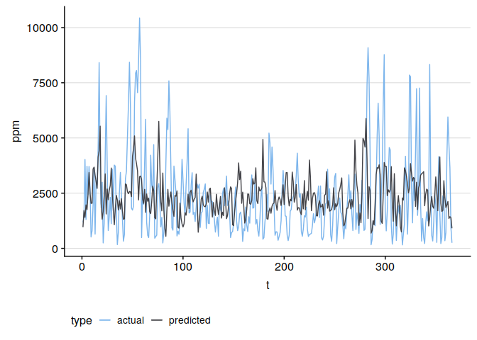

```r
data.frame(t(scores(vpred)))
```

<div data-pagedtable="false">
  <script data-pagedtable-source type="application/json">
{"columns":[{"label":["MAPE"],"name":[1],"type":["dbl"],"align":["right"]},{"label":["ASE"],"name":[2],"type":["dbl"],"align":["right"]}],"data":[{"1":"124.2886","2":"3745787"}],"options":{"columns":{"min":{},"max":[10]},"rows":{"min":[10],"max":[10]},"pages":{}}}
  </script>
</div>

Objectively, this model performed worse than the ARMA/mean baseline model. However, visually, it was only off by a bit. It seems to have gotten the period a bit wrong, while it is accurate in scale. It also has a few issues with the shape, but the forecast does not look unreasonable. This may be an interesting model in our bagged results.

# Neural Network models

We will try two different neural networks, a neural net ar (nnetar) model and a Long short-term memory (LSTM) model. 

The nnetar model is a simple artificial neural network (ANN). For this we will use the `nnetar` function from the `forecast` library. It is still an ANN, just as the ones from nnfor, and it is significantly less customizable than the models from `nnfor`. However, with this much data, and the slowness of `nnfor`, it actually takes over 7 hours to produce a model with our data using `nnfor`. As I plan on eventually deploying this model, and am not going to be spending months tuning a slow `nnfor` model to find the right hyperparameters (with that slowness, I will simply be using near defaults), there is no benefit from using the slower, more customizable model.

A LSTM model is much more complex than the nnetar model, but will hopefully provide us with a better view of the data. We will explor both in depth in the following sections

# ANN Model: nnetar

For the first attempt at neural network forecasting, we will be using nnetar. Nnetaris basically a less flexible implementation of the functions in the `nnfor`. What it lacks in flexibiility it makes up for with extreme speed. We will have our slow model in the next section. For discussion on the comparison of `nnfor` and `nnetar`, please see [this link](https://kourentzes.com/forecasting/2017/02/10/forecasting-time-series-with-neural-networks-in-r/). 

## What does the nnetar function do?

Basically, the `nnetar` function takes in your data, properly scales it for the neural network. We will discuss scaling extensively in the next section, do not worry. After scaling, if needed, it calculates the AR order of the time series, as well as the lags. Then, it takes your scaled time series, the things it calculated and adjustements it made, into the `nnet` function from the nnet library. Then, you have a model and you make predictions. It is very user friendly, and very very fast.
